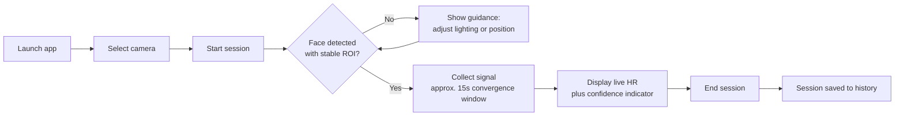
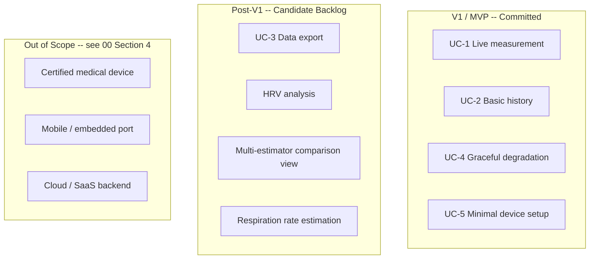

# 01_PROJECT_VISION.md
# Project Vision
## rPPG Desktop Vitals Monitor

---

**Document Control**

| Field | Value |
|---|---|
| Document ID | PV-01 |
| Version | 1.0.0 |
| Status | **BINDING** — Product Intent Layer |
| Depends On | `00_MASTER_PROMPT.md` (Mission §3, Non-Goals §4, AI Identity §2) |
| Consumed By | `02_SOFTWARE_REQUIREMENT.md` (primary), `06_UI_GUIDELINE.md`, `08_ESTIMATOR_ENGINE.md`, `15_TASK.md` |
| Precedence | Subordinate to `00_MASTER_PROMPT.md`. Where the product framing in this document conflicts with 00's Mission (§3) or Non-Goals (§4), 00 prevails. |
| Maintainer | Human Project Architect — Abdi Soleh Rosadi |
| Last Updated | 2026-07-12 |

---

## 1. Purpose of This Document

`00_MASTER_PROMPT.md` establishes what kind of engineer the agent should be and what the project's mission is, in a single abstract paragraph (§3). That abstraction is deliberate — it is too thin to build requirements from directly. This document exists to supply the missing middle layer: **what is this specific piece of software actually trying to achieve, for whom, and how will anyone — human or agent — know if it succeeded?**

This document is the bridge between mission and requirements:

- `02_SOFTWARE_REQUIREMENT.md` cannot be written responsibly without first fixing target users, core use cases, and success criteria. Those are defined here, not there.
- An agent deciding whether a proposed feature belongs in the product checks §9 (Scope) and asks whether the feature serves a persona in §5 or a use case in §6. If it does not, the feature does not belong in this codebase without a scope change to this document first.
- `06_UI_GUIDELINE.md` inherits this document's stance on uncertainty communication (§4, §7) as a binding constraint, not a suggestion — the UI is where the product-level risk of a user overtrusting a reading (§11, R3) is actually mitigated or not.
- `15_TASK.md` prioritizes V1 work using the scope boundary defined in §9.

---

## 2. Vision Statement

> The rPPG Desktop Vitals Monitor is a desktop application that turns any standard webcam into a real-time, non-contact heart-rate sensor — built and engineered to the standard of shippable software, not a research notebook. It exists to prove, end to end, that remote photoplethysmography can be delivered through a responsive, honest, well-tested desktop experience: from the first camera frame to a stable heart-rate reading in under fifteen seconds, with every uncertain measurement clearly flagged rather than confidently guessed.

---

## 3. Problem Statement and Motivation

Remote photoplethysmography — estimating blood-volume-pulse-driven heart rate from subtle, camera-visible skin color variation — is a well-established line of research, not a novel idea this project claims credit for. The specific published techniques this project builds on are catalogued in `07_SIGNAL_PROCESSING.md`, not here.

What is comparatively rare is an rPPG implementation that is simultaneously:

- **Desktop-native and self-contained.** Most public rPPG code is a research script — a Python notebook, a MATLAB file, a Colab cell — rather than an installable application a non-technical person could run without a development environment.
- **Honestly uncertain.** Many demonstrations present a heart-rate number with a fixed, high apparent confidence regardless of actual signal quality. For a signal this sensitive to lighting and motion, that is not a minor UX gap — it is actively misleading.
- **Engineered, not scripted.** Architected, tested, and documented to a standard that would survive a professional code review, rather than optimized purely for "does the number come out roughly right in the demo."

This project exists to close that specific gap: to demonstrate, in a single desktop codebase, that these three properties are achievable together.

---

## 4. Product Goals

| ID | Goal | Rationale |
|---|---|---|
| G1 | Produce a real-time heart-rate estimate from a live, unmodified webcam feed, with no additional hardware. | Core value proposition. Anything requiring specialized hardware defeats the "any standard webcam" premise. |
| G2 | Make signal quality and estimate confidence visible at all times — never present a number without an accompanying trust signal. | Directly addresses the misinterpretation risk in §11 (R3) and the medical-device Non-Goal in `00 §4` (NG-1). |
| G3 | Ship as an installable, self-contained desktop application for Windows, macOS, and Linux. | "Clone and run from source" is a research artifact, not a product — see `14_DEPLOYMENT.md`. |
| G4 | Persist session history so a user can review and compare past measurements. | Supports the reference-implementation differentiator (§7) and gives the persistence layer (`10_DATABASE.md`) a real product reason to exist. |
| G5 | Serve as a credible software-engineering reference: a reviewer should be able to learn the architecture from the code and the 00–15 document set alone. | This is the project's explicit audience-facing goal (§5, Persona A) and the reason `00_MASTER_PROMPT.md`'s rigor exists in the first place. |

---

## 5. Target Users and Personas

No formal user research underlies this section — there is no existing user base to study. The personas below are **illustrative design targets**, used to keep feature and UX decisions grounded in a concrete "who is this for" rather than an abstract "everyone." They are working hypotheses, revisable if real usage ever contradicts them — not market-validated facts, and they should never be cited as such outside this project.

**Persona A — The Technical Evaluator**
- *Who:* a software engineer, technical interviewer, or open-source reviewer assessing engineering quality.
- *Primary interest:* architecture, code quality, test coverage, documentation — not the medical utility of the reading itself.
- *What they need from the product:* a codebase and document set (00–15) that make the design decisions legible within roughly an hour of review.

**Persona B — The Curious Self-Quantifier**
- *Who:* a hobbyist interested in personal biometric tracking, comfortable with the premise that this is not a medical-grade instrument.
- *Primary interest:* a fast, no-account, no-cloud way to check a heart-rate reading out of curiosity.
- *What they need from the product:* near-zero setup friction (G3) and an honest, always-visible confidence signal (G2) so they know when to trust a given reading.

**Persona C — The Downstream Developer**
- *Who:* someone who wants to fork or extend the project — swap in a different estimation algorithm, add HRV analysis, target new hardware.
- *Primary interest:* genuine extensibility, not extensibility that only works on paper.
- *What they need from the product:* the port/adapter boundaries in `00 §9` and `00 §21` to actually hold up when a second real implementation is attempted, per the validation rule in `00 §31`.

---

## 6. Core Use Cases

High-level only — detailed functional requirements, acceptance criteria, and edge cases are the responsibility of `02_SOFTWARE_REQUIREMENT.md`, not this document.

| ID | Use Case | Primary Persona(s) | V1 Priority |
|---|---|---|---|
| UC-1 | Start a live measurement session and view a real-time HR estimate with a visible confidence indicator. | B | Committed |
| UC-2 | Review a list of past sessions and view a summary (HR trend, duration, average confidence) for each. | A, B | Committed (basic form) |
| UC-3 | Export a session's data (waveform and computed metrics) for external analysis. | A, C | Post-V1 |
| UC-4 | Recover gracefully when the camera is disconnected, occluded, or lighting is insufficient, with clear on-screen guidance. | B | Committed |
| UC-5 | Select a capture device and adjust basic capture settings before starting a session. | A, B | Committed (minimal form) |

The primary interaction — UC-1 — follows this journey:

---

## 7. Value Proposition and Differentiators

| Compared To | What They Typically Offer | What This Project Adds |
|---|---|---|
| Academic research scripts (notebooks, MATLAB) | Algorithm correctness in isolation; minimal packaging; little to no handling of real-world operating conditions | An installable application; the full operational error-handling model in `00 §22`; automated test coverage per `00 §10` |
| Consumer wellness apps with camera-based HR features | Polished UI, but usually closed-source, cloud-connected, and opaque about method and uncertainty | Fully local, no cloud dependency (`00 §4`, NG-3); transparent, publicly documented method (`07_SIGNAL_PROCESSING.md`); always-visible confidence (G2) |
| Typical open-source rPPG demo repositories | A working proof of concept; rarely a maintained or tested codebase | Hexagonal architecture (`00 §9`); ≥80% test coverage (`00 §10`); a full, coherent documentation set — a genuine reference implementation, not a weekend script |

---

## 8. Success Criteria (V1)

| ID | Criterion | Type |
|---|---|---|
| SC-1 | The shipped V1 build meets every target in `00 §11` (Performance Goals) on the reference hardware defined in `12_PERFORMANCE.md`. | Technical |
| SC-2 | UC-1, UC-2, and UC-4 each independently satisfy the Definition of Production-Ready (`00 §19.3`). | Quality |
| SC-3 | A first-time user reaches a live HR reading (UC-1) without consulting written instructions, on the first attempt, under normal room lighting. | Usability (informal) |
| SC-4 | A reviewer unfamiliar with the project can correctly describe the system's architecture — layers, ports, threading model — after reading only the 00–15 document set, without reading source code. | Engineering credibility |
| SC-5 | No release build ever displays a numeric HR value without a co-located confidence/quality indicator. | Honesty — enforced as a binding UI acceptance criterion in `06_UI_GUIDELINE.md`, traceable to G2 |

---

## 9. Scope: V1 vs. Future Phases

The V1/Post-V1 boundary is a product decision, revisable by updating this document. The Out-of-Scope tier is not a backlog — it restates `00 §4`'s Non-Goals, which are architectural and philosophical exclusions, not merely deferred features. An agent proposing work from the "Never" tier is not proposing a future feature; it is proposing a mission violation, and follows `00 §8`'s escalation path if it believes the exclusion itself should change.

---

## 10. Assumptions and Operating Constraints

| ID | Assumption |
|---|---|
| A1 | A single, reasonably well-lit environment is assumed — not clinical lighting control, but not near-darkness either. Precise illuminance handling is defined in `07_SIGNAL_PROCESSING.md`. |
| A2 | A single face in frame is assumed for V1; multi-subject tracking is Post-V1 backlog, not committed. |
| A3 | A standard RGB USB or integrated webcam capable of at least 720p at 15 fps is assumed; no IR, depth, or specialized medical camera dependency. |
| A4 | A single local desktop user per session is assumed; no multi-user account or session-sharing model, consistent with `00 §4` (NG-3). |
| A5 | The user has sufficient rights to install a desktop application on their own machine; installer behavior is specified in `14_DEPLOYMENT.md`. |

---

## 11. Product-Level Risks

These are product and domain risks, distinct from the engineering and architectural risks already governed by `00_MASTER_PROMPT.md`.

| ID | Risk | Mitigation Direction |
|---|---|---|
| R1 | rPPG signal quality is inherently sensitive to motion and lighting; a confident-looking wrong number is worse than an honestly uncertain one. | G2 and SC-5 make confidence display non-optional; `08_ESTIMATOR_ENGINE.md` owns the quality-scoring model itself. |
| R2 | Consumer webcam hardware varies widely in color science, auto-exposure, and auto-white-balance behavior, which can shift signal characteristics from device to device. | V1 targets common consumer webcams broadly rather than an exhaustively validated hardware matrix; device-specific issues are logged as `15_TASK.md` items, not silently special-cased inside the estimator. |
| R3 | A user could mistake the reading for a medical-grade measurement despite `00 §4` (NG-1). | UI/UX actively and persistently counters this rather than disclaiming it once at launch — see `06_UI_GUIDELINE.md`. |
| R4 | The illustrative personas in §5 could drift from how the software is actually used if real usage patterns ever diverge from the working hypotheses. | Personas are explicitly marked as revisable, not frozen; §5 is updated the moment evidence contradicts it. |

---

## 12. Stakeholders and Roles

| Role | Responsibility |
|---|---|
| Human Project Architect (Abdi Soleh Rosadi) | Final decision authority; resolves escalations raised per `00 §40`; owns changes to this document. |
| Autonomous Coding Agents | Implement against this vision and the requirements derived from it; do not unilaterally reinterpret scope (§9) without following `00 §8`'s decision process. |
| Future Reviewers and Contributors | The explicit audience for G5 and Persona A; this document's clarity is written for them as much as for the agents building the software. |

---

## 13. Relationship to Other Documents

| Document | What It Inherits From This Document |
|---|---|
| `02_SOFTWARE_REQUIREMENT.md` | Functional requirements are derived directly from §6 (Core Use Cases); non-functional requirements incorporate §8 (Success Criteria) and §10 (Assumptions). |
| `06_UI_GUIDELINE.md` | The uncertainty-transparency stance (G2, SC-5) and the misinterpretation risk (R3) are binding constraints on UI design, not suggestions. |
| `08_ESTIMATOR_ENGINE.md` | The confidence/quality-scoring requirement (G2) originates here; the engine is answerable to this document for *why* that requirement exists. |
| `15_TASK.md` | Task prioritization for V1 follows §9's scope boundary; anything in the Post-V1 or Out-of-Scope tiers is not scheduled without an explicit, recorded scope change to this document. |

---

## 14. Revision History

| Version | Date | Change |
|---|---|---|
| 1.0.0 | 2026-07-12 | Initial ratified version, consistent with `00_MASTER_PROMPT.md` v1.0.0 (Java 25 LTS baseline). |

---

*End of 01_PROJECT_VISION.md. Subordinate to `00_MASTER_PROMPT.md`; binding on `02_SOFTWARE_REQUIREMENT.md` and all documents listed in §13.*