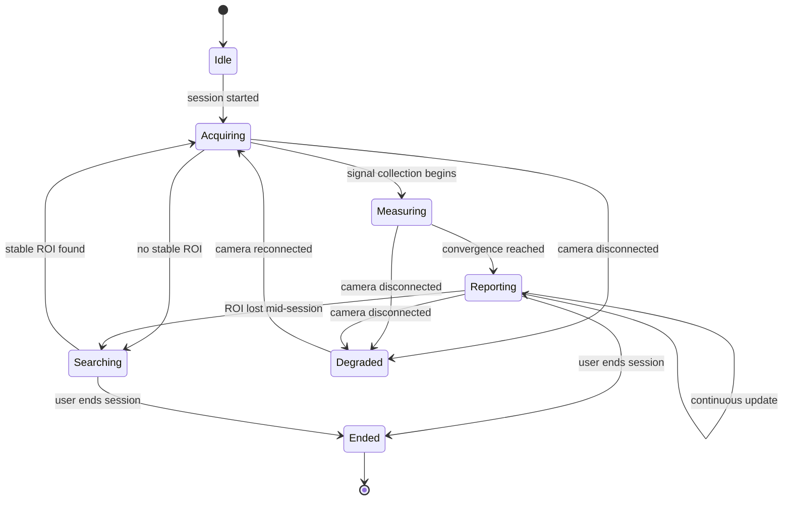

# 02_SOFTWARE_REQUIREMENT.md
# Software Requirements Specification
## rPPG Desktop Vitals Monitor

---

**Document Control**

| Field | Value |
|---|---|
| Document ID | SRS-02 |
| Version | 1.0.0 |
| Status | **BINDING** — Requirements Layer |
| Depends On | `00_MASTER_PROMPT.md` (§4, §10, §11, §12), `01_PROJECT_VISION.md` (§4–§11) |
| Consumed By | `03_ARCHITECTURE.md` (primary), `06_UI_GUIDELINE.md`, `07_SIGNAL_PROCESSING.md`, `08_ESTIMATOR_ENGINE.md`, `09_AI_INTEGRATION.md`, `10_DATABASE.md`, `12_PERFORMANCE.md`, `13_TESTING.md`, `14_DEPLOYMENT.md` |
| Precedence | Subordinate to `00_MASTER_PROMPT.md` and `01_PROJECT_VISION.md`. A requirement here that contradicts a Non-Goal (`00 §4`) or an Out-of-Scope item (`01 §9`) is invalid by construction and must be corrected, not implemented. |
| Maintainer | Human Project Architect — Abdi Soleh Rosadi |
| Last Updated | 2026-07-12 |

---

## 1. Purpose of This Document

`01_PROJECT_VISION.md` establishes *why* this product exists, *who* it is for, and *what counts as success*, at the altitude of use cases and goals. That altitude is intentionally too high to build an architecture from directly — "start a live measurement session" is a use case, not something `03_ARCHITECTURE.md` can design a module boundary against.

This document exists to close that gap: every requirement below is a **testable, unambiguous statement** derived from a specific use case (`01 §6`), goal (`01 §4`), or success criterion (`01 §8`). Nothing in this document introduces new product intent — if a requirement here cannot be traced to something already established in `00` or `01`, it does not belong here, and its addition should be treated as a scope change to `01_PROJECT_VISION.md` first.

Practically:

- `03_ARCHITECTURE.md` designs module and port boundaries so that every requirement in §3–§6 below has an obvious home.
- `07_SIGNAL_PROCESSING.md` and `08_ESTIMATOR_ENGINE.md` treat §3.1 (Live Measurement) and the timing/quality figures in §4.1 as their concrete design targets.
- `06_UI_GUIDELINE.md` treats §3.4 (Degradation and Recovery), §4.3 (Usability), and §4.7 (Compliance) as binding acceptance criteria for screen designs, not inspiration.
- `10_DATABASE.md` treats §5 (Data Requirements) as the schema's non-negotiable starting constraint, particularly on what is *never* persisted.
- `13_TESTING.md` treats §8 (Verification Approach) as the source of what a passing test suite must actually demonstrate.

---

## 2. Requirement Notation and Prioritization

Requirement statements use RFC 2119-style keywords:

- **SHALL** — mandatory; the system is non-conformant without it.
- **SHOULD** — strongly recommended; a deviation requires a recorded justification (ADR, per `00 §8`).
- **MAY** — optional; present for completeness, not a commitment.

Each requirement additionally carries a **priority/phase tag** in square brackets, e.g. `[Must, V1]` or `[Should, Post-V1]`. The phase (`V1` / `Post-V1`) maps directly to the scope tiers defined in `01 §9`; a requirement tagged `Post-V1` is fully specified here so it is ready to implement later, but it is **not** scheduled in `15_TASK.md` until a scope decision moves it into V1.

---

## 3. Functional Requirements

### 3.1 Live Measurement (traces to `01` UC-1, G1, G2)

| ID | Requirement |
|---|---|
| FR-101 | The system SHALL enumerate available camera devices connected to the host machine and present them for selection before a session starts. `[Must, V1]` |
| FR-102 | The system SHALL, upon session start, continuously acquire frames from the selected camera at a configurable target frame rate (default 30 fps). `[Must, V1]` |
| FR-103 | The system SHALL detect the presence of a face and a stable region of interest (ROI) within the frame stream, and SHALL visually indicate when no stable ROI is available. `[Must, V1]` |
| FR-104 | The system SHALL extract an rPPG signal from the stable ROI and compute a heart-rate estimate once sufficient signal has been collected, targeting convergence within 15 seconds (`00 §11`). `[Must, V1]` |
| FR-105 | The system SHALL update the displayed heart-rate estimate continuously, in near-real-time, for the duration of an active session. `[Must, V1]` |
| FR-106 | The system SHALL display a confidence/signal-quality indicator alongside every displayed heart-rate value, with no exception. `[Must, V1]` — traces directly to `01 §8` SC-5. |
| FR-107 | The system SHALL allow the user to explicitly end a session at any time; upon ending, live acquisition stops and the session is finalized for persistence (`§5`). `[Must, V1]` |

### 3.2 Session History (traces to `01` UC-2, G4)

| ID | Requirement |
|---|---|
| FR-201 | The system SHALL persist a summary record for every completed session: start time, duration, mean HR, mean confidence. `[Must, V1]` |
| FR-202 | The system SHALL present a chronological list of past sessions. `[Must, V1]` |
| FR-203 | The system SHOULD allow the user to select a past session and view its HR trend over the session duration. `[Should, V1]` |
| FR-204 | The system SHOULD allow the user to delete a past session record. `[Should, V1]` |

### 3.3 Data Export (traces to `01` UC-3 — Post-V1)

| ID | Requirement |
|---|---|
| FR-301 | The system SHOULD allow the user to export a session's computed metrics (HR trend, summary statistics) to a structured file format (CSV and/or JSON). `[Should, Post-V1]` |
| FR-302 | Exported data SHALL NEVER include raw camera frames or facial imagery. `[Must, whenever FR-301 is implemented]` — traces to §5, DR-1. |

### 3.4 Degradation and Recovery (traces to `01` UC-4, R1, R3)

| ID | Requirement |
|---|---|
| FR-401 | The system SHALL detect camera disconnection during an active session and SHALL present a clear, non-technical recovery message rather than terminating unexpectedly. `[Must, V1]` |
| FR-402 | The system SHALL detect insufficient lighting that prevents reliable signal extraction and SHALL communicate it with actionable guidance (e.g., "move to a brighter area"). `[Must, V1]` |
| FR-403 | The system SHALL detect loss of a stable ROI mid-session (face moved out of frame, occluded) and SHALL pause heart-rate computation with a visible status change, resuming automatically once a stable ROI returns. `[Must, V1]` |

The session lifecycle implied by §3.1 and §3.4 together forms one coherent state model, not two independent feature sets:

`08_ESTIMATOR_ENGINE.md` owns the authoritative version of this state model; the diagram above is the requirements-level view and must stay consistent with it.

### 3.5 Device and Capture Configuration (traces to `01` UC-5)

| ID | Requirement |
|---|---|
| FR-501 | The system SHALL allow the user to select which connected camera device to use, if more than one is available. `[Must, V1]` |
| FR-502 | The system SHOULD allow the user to view the effective capture resolution and frame rate in use; changing them is not required for V1. `[Should, V1]` |

---

## 4. Non-Functional Requirements

Organized against ISO/IEC 25010 software quality characteristics, scoped to the ones materially relevant to this project.

### 4.1 Performance Efficiency (traces to `00 §11`)

| ID | Requirement |
|---|---|
| NFR-101 | Camera-to-display latency SHALL NOT exceed 100 ms. `[Must, V1]` |
| NFR-102 | Frame processing SHALL sustain a budget of ≤33 ms/frame under normal operating load. `[Must, V1]` |
| NFR-103 | Cold start to first live preview frame SHALL NOT exceed 3 s on the reference hardware defined in `12_PERFORMANCE.md`. `[Must, V1]` |
| NFR-104 | Steady-state memory footprint SHALL NOT exceed 512 MB heap, excluding native library memory. `[Must, V1]` |

### 4.2 Compatibility and Portability (traces to `01` G3)

| ID | Requirement |
|---|---|
| NFR-201 | The application SHALL run on Windows, macOS, and Linux desktop environments. `[Must, V1]` |
| NFR-202 | The application SHALL package as a self-contained installable artifact per platform, requiring no separate JDK installation by the end user. `[Must, V1]` — see `14_DEPLOYMENT.md`. |
| NFR-203 | The application SHALL function with any standard UVC-compatible webcam meeting the minimum spec in `01 §10` (A3), without device-specific code paths for common consumer hardware. `[Must, V1]` |

### 4.3 Usability (traces to `01` SC-3)

| ID | Requirement |
|---|---|
| NFR-301 | A first-time user SHALL be able to reach a live HR reading without consulting external documentation. `[Must, V1]` |
| NFR-302 | All error and degraded-state messages (FR-401–FR-403) SHALL be written in plain, non-technical language; raw exception text or stack traces SHALL NOT be shown to the user. `[Must, V1]` |
| NFR-303 | The confidence/quality indicator (FR-106) SHALL be interpretable at a glance, without requiring the user to consult documentation to understand what it means. `[Must, V1]` |

### 4.4 Reliability (traces to `00 §22`)

| ID | Requirement |
|---|---|
| NFR-401 | The application SHALL NOT crash or become unresponsive as a result of camera disconnection, insufficient lighting, or loss of face tracking — these are handled operational states (FR-401–FR-403), not failure states. `[Must, V1]` |
| NFR-402 | A session interrupted by an application crash SHALL NOT corrupt previously persisted session records. `[Must, V1]` — traces to `10_DATABASE.md`'s transactional guarantees. |

### 4.5 Security and Privacy (traces to `00 §4` NG-3, `§5` below)

| ID | Requirement |
|---|---|
| NFR-501 | The system SHALL NOT transmit any camera frame, derived signal data, or session record to a network destination under any default configuration. `[Must, V1]` |
| NFR-502 | All persisted data (§5, categories b and c) SHALL reside in a single local, user-controlled file; the user SHALL be able to locate and manually delete this file outside the application. `[Must, V1]` |
| NFR-503 | The system SHALL NOT require any user account, authentication, or personally identifying registration to operate. `[Must, V1]` — traces to `01 §5` Persona B. |

### 4.6 Maintainability (traces to `00 §12`)

| ID | Requirement |
|---|---|
| NFR-601 | The codebase SHALL satisfy the quality gates defined in `00 §10` for every merged change. `[Must, V1]` |
| NFR-602 | The system SHALL be extensible to a second signal-estimation algorithm without modifying the Application or Presentation layers. `[Must, V1]` — traces to `00 §21`, `00 §31`. |

### 4.7 Compliance and Non-Medical Framing (traces to `00 §4` NG-1, `01 §11` R3)

| ID | Requirement |
|---|---|
| NFR-701 | The application SHALL NOT present, label, or market itself as a medical or diagnostic device in any UI text, exported file, or documentation string. `[Must, V1]` |
| NFR-702 | Every screen displaying a heart-rate value SHALL include a persistent indication that the reading is not medical-grade; this indication SHALL NOT be dismissible in a way that removes it for the remainder of the session. `[Must, V1]` — see `06_UI_GUIDELINE.md`. |

---

## 5. Data Requirements

The system distinguishes three data categories. This taxonomy is binding on `10_DATABASE.md` and on any future feature touching visual data.

| ID | Category | Definition | Persistence Rule |
|---|---|---|---|
| DR-1 | **(a) Ephemeral — Raw Frames** | Raw camera frames and any intermediate image buffers used during ROI detection and signal extraction. | SHALL NOT be persisted to any disk or database, under any default configuration. SHALL be discarded within one processing cycle of use. |
| DR-2 | **(b) Derived Signal Data** | Extracted rPPG waveform samples and computed metrics (HR, confidence, HRV where applicable). | SHALL be persisted per session (FR-201). |
| DR-3 | **(c) Session Metadata** | Timestamps, duration, device identifier, application version. | SHALL be persisted per session (FR-201); retained until explicitly deleted by the user (FR-204) — the system SHALL NOT auto-expire history in V1. |
| DR-4 | **(d) Future Visual Data (hypothetical)** | Any feature that would persist a visual artifact (e.g., a debug ROI snapshot for troubleshooting). | Does not exist in V1. If ever introduced, SHALL be a distinct, explicitly-named category requiring separate, explicit per-action user opt-in — SHALL NOT be silently bundled into categories (b) or (c), and requires a scope change to `01_PROJECT_VISION.md` before implementation. |

---

## 6. Interface Requirements

| ID | Interface | Requirement |
|---|---|---|
| IR-1 | Camera | The system SHALL interface with capture devices through an OS-level camera abstraction (OpenCV `VideoCapture` or equivalent), supporting standard UVC devices without vendor-specific drivers. |
| IR-2 | Persistence | The system SHALL interface with local storage via a single SQLite database file, located in a platform-appropriate application-data directory. |
| IR-3 | Export (Post-V1) | When FR-301 is implemented, the export interface SHALL write CSV and/or JSON files to a user-chosen filesystem location via a standard OS file-save dialog. |
| IR-4 | Network | The system SHALL require no network interface for any V1-committed use case (UC-1, UC-2, UC-4, UC-5). |

---

## 7. Traceability Matrix

| Requirement Family | IDs | Source (`01`) | Detailed / Implemented In |
|---|---|---|---|
| Live Measurement | FR-101–FR-107 | UC-1, G1, G2 | `07_SIGNAL_PROCESSING.md`, `08_ESTIMATOR_ENGINE.md`, `06_UI_GUIDELINE.md` |
| Session History | FR-201–FR-204 | UC-2, G4 | `10_DATABASE.md`, `06_UI_GUIDELINE.md` |
| Data Export | FR-301–FR-302 | UC-3 | `10_DATABASE.md`, `06_UI_GUIDELINE.md` (Post-V1) |
| Degradation & Recovery | FR-401–FR-403 | UC-4, R1, R3 | `08_ESTIMATOR_ENGINE.md`, `09_AI_INTEGRATION.md`, `06_UI_GUIDELINE.md` |
| Device Configuration | FR-501–FR-502 | UC-5 | `06_UI_GUIDELINE.md`, `04_PACKAGE_STRUCTURE.md` |
| Performance Efficiency | NFR-101–NFR-104 | `00 §11` | `12_PERFORMANCE.md`, `11_THREADING.md` |
| Compatibility & Portability | NFR-201–NFR-203 | G3 | `14_DEPLOYMENT.md` |
| Usability | NFR-301–NFR-303 | SC-3 | `06_UI_GUIDELINE.md` |
| Reliability | NFR-401–NFR-402 | — | `00 §22`, `10_DATABASE.md`, `13_TESTING.md` |
| Security & Privacy | NFR-501–NFR-503, DR-1–DR-4 | `00 §4` NG-3 | `10_DATABASE.md`, `09_AI_INTEGRATION.md` |
| Maintainability | NFR-601–NFR-602 | `00 §12` | `04_PACKAGE_STRUCTURE.md`, `05_CODING_STANDARD.md` |
| Compliance / Non-Medical | NFR-701–NFR-702 | `00 §4` NG-1, R3 | `06_UI_GUIDELINE.md` |

Every row must resolve in both directions: an agent implementing anything in the right-hand column that cannot point back to a requirement ID here is out of scope by default (`00 §8`); a requirement ID with no downstream document listed is a gap in this document, not a license to design it ad hoc.

---

## 8. Verification Approach

Full test strategy and tooling live in `13_TESTING.md`; this section states what a passing suite must actually demonstrate for each requirement class, so `13_TESTING.md` has a concrete target rather than an abstract coverage percentage.

| Requirement Class | Verification Method |
|---|---|
| Functional (FR-1xx–FR-5xx) | Automated unit/integration tests against golden-file signal fixtures (`00 §14`) plus the manual UI checklist for interaction-only behavior (e.g., device-selection UI). |
| Performance (NFR-1xx) | Automated benchmark harness defined in `12_PERFORMANCE.md`, run against the reference hardware profile; a regression beyond target is a build-blocking failure, not a warning. |
| Reliability (NFR-4xx) | Fault-injection tests: simulated camera disconnection, corrupted/empty frame streams, forced application termination mid-write, asserting no crash and no data corruption. |
| Security & Privacy (NFR-5xx, DR-1–DR-4) | A dedicated automated test asserting zero outbound network sockets are opened during a full session lifecycle, plus a test asserting no image/frame data appears in the SQLite file or on disk after a session completes. |
| Usability (NFR-3xx) | Manual checklist against `01 §8` SC-3, executed by someone who has not seen the UI before. |
| Compliance (NFR-7xx) | Manual review of every screen and exported artifact against the non-medical framing checklist in `06_UI_GUIDELINE.md`. |

---

## 9. Relationship to Other Documents

| Document | What It Inherits From This Document |
|---|---|
| `03_ARCHITECTURE.md` | Module and port boundaries are designed so every FR and NFR family in §3–§4 has an unambiguous owning component. |
| `06_UI_GUIDELINE.md` | §3.4, §4.3, and §4.7 are binding acceptance criteria for screen design, not inspiration. |
| `07_SIGNAL_PROCESSING.md` / `08_ESTIMATOR_ENGINE.md` | §3.1 and the state model in §3.4 are the concrete design target for the signal pipeline and estimator. |
| `10_DATABASE.md` | §5's data taxonomy is the schema's starting constraint, particularly DR-1's persistence prohibition. |
| `12_PERFORMANCE.md` | §4.1 supplies the exact figures the benchmark harness must validate against. |
| `13_TESTING.md` | §8 defines what "passing" means per requirement class. |
| `15_TASK.md` | Only `V1`-tagged requirements are eligible for scheduling without a prior scope change to `01_PROJECT_VISION.md`. |

---

## 10. Revision History

| Version | Date | Change |
|---|---|---|
| 1.0.0 | 2026-07-12 | Initial ratified version, derived from `01_PROJECT_VISION.md` v1.0.0. |

---

*End of 02_SOFTWARE_REQUIREMENT.md. Subordinate to `00_MASTER_PROMPT.md` and `01_PROJECT_VISION.md`; binding on all documents listed in §9.*