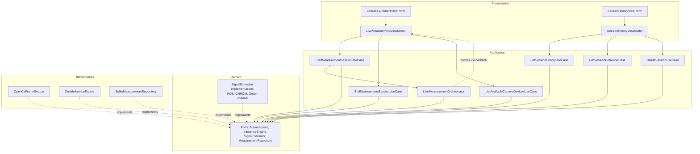
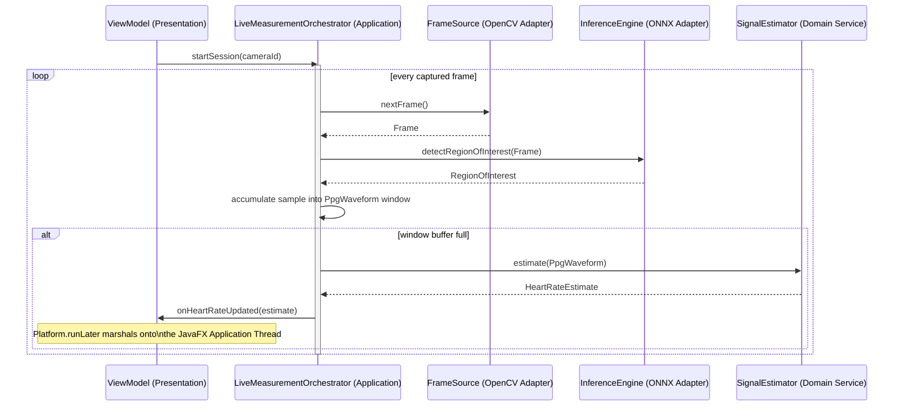
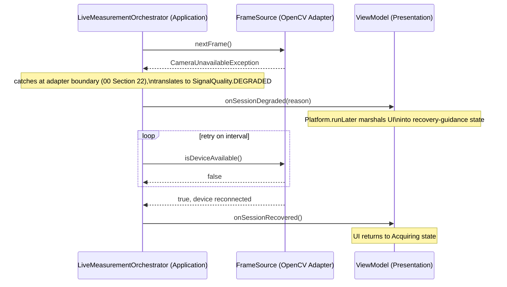
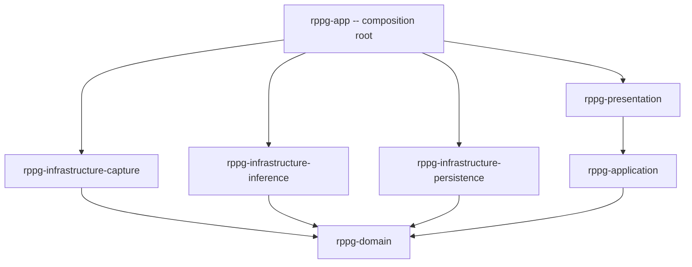

# 03_ARCHITECTURE.md
# System Architecture
## rPPG Desktop Vitals Monitor

---

**Document Control**

| Field | Value |
|---|---|
| Document ID | ARC-03 |
| Version | 1.0.0 |
| Status | **BINDING** — Technical Design Layer |
| Depends On | `00_MASTER_PROMPT.md` (§5, §6, §9, §16, §21, §29), `02_SOFTWARE_REQUIREMENT.md` (all sections) |
| Consumed By | `04_PACKAGE_STRUCTURE.md`, `06_UI_GUIDELINE.md`, `07_SIGNAL_PROCESSING.md`, `08_ESTIMATOR_ENGINE.md`, `09_AI_INTEGRATION.md`, `10_DATABASE.md`, `11_THREADING.md` |
| Precedence | Subordinate to `00_MASTER_PROMPT.md`. Where this document elaborates on `00 §9`, it must not contradict it; where it disambiguates something `00 §9` left intentionally general (e.g., which specific adapters implement which ports), this document is authoritative. |
| Maintainer | Human Project Architect — Abdi Soleh Rosadi |
| Last Updated | 2026-07-12 |

---

## 1. Purpose of This Document

`00_MASTER_PROMPT.md §9` establishes that this system is a four-layer hexagonal architecture and states the Dependency Rule as a non-negotiable constraint. It deliberately stops there — it is a governance document, not a design document, and naming every port, component, and interaction at that level would have made it unmaintainable as a rarely-changing constitution.

This document is where that principle becomes a concrete, buildable design. It exists so that:

- `04_PACKAGE_STRUCTURE.md` has actual component and module names to organize into packages, instead of inventing them ad hoc.
- `07_SIGNAL_PROCESSING.md` and `08_ESTIMATOR_ENGINE.md` know exactly which port (`SignalEstimator`) and which domain types (`PpgWaveform`, `HeartRateEstimate`) they are responsible for, and what is out of their responsibility (frame acquisition, ROI detection).
- `09_AI_INTEGRATION.md` knows precisely what the `InferenceEngine` port must promise, without needing to re-derive it.
- `10_DATABASE.md` knows exactly what `MeasurementRepository` must support, traced to `02 §3.2`'s requirements.
- `11_THREADING.md` has a named component — `LiveMeasurementOrchestrator` — to attach concrete executor and queue design to, instead of an abstract "the pipeline."

Every component named in this document is binding. An agent introducing a differently-named or differently-scoped component for the same responsibility is not exercising creative freedom; it is deviating from an approved design and must follow `00 §8`'s decision process first.

---

## 2. Architectural Style and Rationale

The system is Hexagonal Architecture (Ports and Adapters), as mandated by `00 §9`. This section records *why*, including the alternatives considered and rejected — a decision without recorded alternatives is not a decision, it is an assumption.

| Alternative | Why It Was Rejected |
|---|---|
| Simple layered/N-tier (Controller → Service → DAO) | Does not cleanly support swapping `SignalEstimator` algorithms (`02` NFR-602) or testing signal logic without a live camera (`00 §6`); tends to blur where domain logic actually lives as the "Service" layer accumulates both orchestration and business rules. |
| Transaction Script (one large class per operation) | Violates `00 §5` (composition over inheritance, single responsibility) and `00 §7` (small functions) almost immediately at any realistic feature size. |
| Full Event Sourcing / CQRS | Considered and rejected as disproportionate. This is a single-user desktop application with modest data volume (`01 §10` A4); event sourcing's auditability and replay benefits do not offset its complexity cost here. |
| **Hexagonal / Ports and Adapters (chosen)** | The explicit multi-algorithm requirement (`00 §21.1`'s `SignalEstimator` justification, `02` NFR-602) and the explicit test-without-hardware principle (`00 §6`) are best served by ports. This is the minimum structure that satisfies the extensibility requirement without over-engineering a solo-developer desktop app. |

---

## 3. Domain Model Overview

The following types are owned by the Domain layer. They are described here at the level of *what they represent*, not as code — exact field types, validation rules, and JavaDoc belong to implementation, not this document.

| Type | Kind | Description |
|---|---|---|
| `Frame` | Value Object (record) | A single captured camera frame: pixel-buffer reference, capture timestamp, frame sequence index. |
| `RegionOfInterest` | Value Object (record) | A detected face region within a `Frame`: bounding box, landmark reference, detection confidence. |
| `PpgSample` | Value Object (record) | One windowed sample of the extracted rPPG signal: timestamp, per-channel amplitude. |
| `PpgWaveform` | Value Object (record) | An ordered, bounded window of `PpgSample`s, ready for estimation. |
| `HeartRateEstimate` | Value Object (record) | A computed HR value: bpm, confidence score, timestamp, contributing algorithm identifier. |
| `SignalQuality` | Sealed type | `STABLE` / `SEARCHING` / `DEGRADED` — mirrors the session state model in `02 §3.4`. |
| `MeasurementSession` | Entity | A single measurement session: identity, start/end time, device used, accumulated estimates, final status. |
| `SessionSummary` | Value Object (record) | A lightweight projection of a `MeasurementSession` for history listing (`02` FR-202). |
| `CaptureConfiguration` | Value Object (record) | Selected camera device identifier and target capture parameters (`02` FR-501, FR-502). |

All of the above are plain Java types with, at most, a dependency on Apache Commons Math (for `PpgWaveform`/`HeartRateEstimate`-adjacent computation) or the JDK standard library. None depend on `javafx.*`, `org.opencv.*`, ONNX Runtime types, or `org.sqlite.*` — per `00 §9`'s Dependency Rule.

---

## 4. Port Catalog

Ports are Domain-owned interfaces. This table states each port's responsibility and *who implements it* — which is the detail `00 §9`'s diagram deliberately abstracted away.

| Port | Owned By | Implemented By | Responsibility |
|---|---|---|---|
| `FrameSource` | Domain | Infrastructure — `OpenCvFrameSource` | Enumerate available camera devices; open a selected device; yield a continuous stream of `Frame`s; release the device deterministically on close. |
| `InferenceEngine` | Domain | Infrastructure — `OnnxInferenceEngine` (see `09_AI_INTEGRATION.md`) | Given a `Frame`, detect face presence and return a `RegionOfInterest`, or a typed "no face" result — never an exception for the normal absence of a face (`00 §22.2`). |
| `SignalEstimator` | Domain | **Domain itself** — `PosSignalEstimator`, `ChromSignalEstimator`, `GreenChannelSignalEstimator` (see §5.1 below) | Given a `PpgWaveform`, compute a `HeartRateEstimate` with an associated confidence score. |
| `MeasurementRepository` | Domain | Infrastructure — `SqliteMeasurementRepository` | Persist a completed `MeasurementSession`; list `SessionSummary` records; retrieve full session detail; delete a session record. Traces to `02 §3.2`. |

**A note on `SignalEstimator`.** Unlike the other three ports, `SignalEstimator` implementations are *not* Infrastructure adapters. They depend only on Apache Commons Math — a pure computation library with no I/O and no control-flow inversion — and are therefore implemented directly within the Domain layer as Domain Services, fully unit-testable with zero adapters involved. `00 §9`'s master-prompt-level diagram grouped all four ports together for brevity; this document is the authoritative, precise version of that relationship.

**A note on rendering.** XChart, used to draw the live waveform and history trend, is **not** behind a Domain port. It is a Presentation-layer concern, used directly by Views alongside JavaFX itself — the Presentation layer is the outermost, framework-coupled layer by design (`00 §9`), and introducing a port for it would be exactly the kind of premature abstraction `00 §7` prohibits. The Domain never needs to "render a chart"; it only ever produces data that the Presentation layer chooses how to display.

---

## 5. Component Diagram

---

## 6. Layer-by-Layer Breakdown

### 6.1 Domain Layer

Contains: the types in §3, the ports in §4, and the `SignalEstimator` implementations. This layer has no knowledge that a webcam, a database, or a window exists — it only knows about frames, regions, waveforms, and estimates as data.

`SignalQuality` (`STABLE` / `SEARCHING` / `DEGRADED`) is the domain's own encoding of the session state model first introduced in `02 §3.4`; `08_ESTIMATOR_ENGINE.md` owns the exact transition rules between these states.

### 6.2 Application Layer

Two kinds of components live here, and they are architecturally different despite both being "Application layer":

**Discrete use cases** — single-shot, named as verbs/intents per `00 §29`, each with one entry point: `StartMeasurementSessionUseCase`, `EndMeasurementSessionUseCase`, `ListSessionHistoryUseCase`, `GetSessionDetailUseCase`, `DeleteSessionUseCase`, `ListAvailableCameraDevicesUseCase`. These map directly to `02`'s functional requirement families in §3.2, §3.5.

**`LiveMeasurementOrchestrator`** — not a discrete use case. `StartMeasurementSessionUseCase` starts it; `EndMeasurementSessionUseCase` stops it. Between those two calls, it is a sustained process, driven by the threading model in `00 §15`, that repeatedly: pulls a `Frame` from `FrameSource`, passes it to `InferenceEngine`, accumulates the resulting `RegionOfInterest` signal into a windowed `PpgWaveform`, and — once the window is full — invokes `SignalEstimator` and emits the resulting `HeartRateEstimate`.

Forcing this into the classic single-`execute()` use case shape would mean invoking a "use case" up to 30 times per second, which is both semantically wrong (it is not a discrete user intent) and operationally wasteful. The orchestrator is the Application layer's honest acknowledgment that this product is a streaming pipeline with a request/response shell around it, not a request/response application with a pipeline bolted on.

**Result delivery.** The orchestrator emits results through a plain, Domain/Application-owned callback interface (illustratively, a `MeasurementObserver` with methods such as `onHeartRateUpdated`, `onSignalQualityChanged`, `onSessionDegraded`, `onSessionRecovered`) — never through a JavaFX type. The Presentation-layer ViewModel implements this callback interface and, inside each callback, marshals the update onto the JavaFX Application Thread (`Platform.runLater`, per `00 §15`) before writing to its own `ObservableValue`/`Property` fields. This is the precise seam where the Dependency Rule is preserved *and* real-time UI reactivity is achieved — the Application layer never imports `javafx.*`, and the Presentation layer never blocks or computes.

### 6.3 Infrastructure Layer

Three adapters, each implementing exactly one port, each depending on Domain only:

- `OpenCvFrameSource` implements `FrameSource` using OpenCV's video-capture APIs.
- `OnnxInferenceEngine` implements `InferenceEngine` using ONNX Runtime's Java API, per the integration strategy `09_AI_INTEGRATION.md` finalizes (`00 §31`).
- `SqliteMeasurementRepository` implements `MeasurementRepository` using the SQLite JDBC driver, per the schema `10_DATABASE.md` defines.

No adapter is aware of any other adapter's existence. `OpenCvFrameSource` does not know `SqliteMeasurementRepository` exists, and must not import it, per `00 §12`'s adapter-coupling prohibition.

### 6.4 Presentation Layer

JavaFX, structured MVVM per `00 §24`: FXML views (`LiveMeasurementView`, `SessionHistoryView`) bind to ViewModels (`LiveMeasurementViewModel`, `SessionHistoryViewModel`), which expose `ObservableValue`/`Property` state and delegate every action to an Application-layer use case or to the orchestrator. Controllers contain no business logic — a Controller that computes anything beyond simple presentation formatting (e.g., "bpm" unit suffixing) is a design defect per `00 §24`.

---

## 7. Key Sequence Diagrams

### 7.1 Live Measurement — Single Pipeline Tick (Happy Path)

Traces to `02` FR-102 through FR-106.

### 7.2 Degradation and Recovery — Camera Disconnected Mid-Session

Traces to `02` FR-401.

---

## 8. Module and Build Mapping

`00 §26` requires that layer boundaries be reflected as physical Maven modules wherever practical, so a Dependency Rule violation fails the build rather than only a code review. This project uses seven modules:

| Module | Contains | Depends On |
|---|---|---|
| `rppg-domain` | Types (§3), ports (§4), `SignalEstimator` implementations | JDK, Apache Commons Math only |
| `rppg-application` | Use cases, `LiveMeasurementOrchestrator`, `MeasurementObserver` | `rppg-domain` |
| `rppg-infrastructure-capture` | `OpenCvFrameSource` | `rppg-domain`, OpenCV |
| `rppg-infrastructure-inference` | `OnnxInferenceEngine` | `rppg-domain`, ONNX Runtime |
| `rppg-infrastructure-persistence` | `SqliteMeasurementRepository` | `rppg-domain`, SQLite JDBC |
| `rppg-presentation` | FXML views, ViewModels, Controllers | `rppg-application`, JavaFX, XChart |
| `rppg-app` | Composition root: `Main`, dependency wiring, Logback config | All of the above |

Only `rppg-app` is permitted to depend on every other module — this is where adapters are instantiated and wired into use cases and the orchestrator at startup (the composition root, per `00 §30`'s Singleton guidance: no static `getInstance()`, explicit wiring here instead). `rppg-presentation` never depends on an infrastructure module directly; it only ever sees `rppg-application`'s use cases and the `MeasurementObserver` contract. Full package layout within each module is `04_PACKAGE_STRUCTURE.md`'s responsibility.

---

## 9. Requirements Coverage

Consolidated view of which architectural component is answerable for which `02` requirement family — a finer grain than `02 §7`'s document-level traceability matrix.

| Requirement Family (`02`) | Owning Component(s) |
|---|---|
| Live Measurement (FR-101–FR-107) | `LiveMeasurementOrchestrator`, `FrameSource`, `InferenceEngine`, `SignalEstimator` |
| Session History (FR-201–FR-204) | `ListSessionHistoryUseCase`, `GetSessionDetailUseCase`, `DeleteSessionUseCase`, `MeasurementRepository` |
| Data Export (FR-301–FR-302, Post-V1) | Future `ExportSessionUseCase`, accommodated by existing `MeasurementSession` data already exposed via `MeasurementRepository` — no new port required |
| Degradation & Recovery (FR-401–FR-403) | `LiveMeasurementOrchestrator`'s exception-translation boundary (§7.2), `SignalQuality` |
| Device Configuration (FR-501–FR-502) | `ListAvailableCameraDevicesUseCase`, `FrameSource`, `CaptureConfiguration` |
| Performance (NFR-101–NFR-104) | `LiveMeasurementOrchestrator`'s bounded queues (`00 §15`, detailed in `11_THREADING.md`) |
| Security & Privacy (NFR-501–NFR-503, DR-1–DR-4) | `Frame` never crosses into `rppg-infrastructure-persistence`; only `PpgWaveform`/`HeartRateEstimate`/`MeasurementSession` do |
| Maintainability (NFR-601–NFR-602) | The port catalog (§4) itself — a second `SignalEstimator` or `FrameSource` implementation requires zero changes outside its own module |

---

## 10. Architectural Risks and Trade-offs

| ID | Trade-off | Resolution |
|---|---|---|
| AR-1 | Hexagonal architecture adds indirection (extra interfaces, extra mapping) compared to a simpler layered design. | Accepted — justified specifically by the multi-algorithm requirement and hardware-free testability goal (§2); would not be justified for a simpler CRUD-style application. |
| AR-2 | The real-time pipeline does not fit the classic single-request "use case" shape cleanly. | Resolved via `LiveMeasurementOrchestrator` as a distinct, named Application-layer concept (§6.2) rather than forcing an awkward fit or abandoning the use-case pattern entirely. |
| AR-3 | SQLite has limited concurrent-write scalability compared to a client-server database. | Accepted — irrelevant given the single-user, single-process usage pattern (`01 §10` A4, `02` NFR-502); revisit only if a future multi-user mode is ever approved, which would itself require a `01_PROJECT_VISION.md` scope change. |
| AR-4 | The Domain layer is allowed to depend on Apache Commons Math, a third-party library, which appears to bend `00 §6`'s "framework-free domain" principle. | Deliberate, bounded exception: Commons Math is a computation library with no I/O and no control-flow inversion, unlike JavaFX/OpenCV/SQLite. It does not compromise the domain's testability or portability, which is the actual property `00 §6` protects. |

---

## 11. Relationship to Other Documents

| Document | What It Inherits From This Document |
|---|---|
| `04_PACKAGE_STRUCTURE.md` | The seven-module layout (§8) and the component names in §5–§6 map directly onto concrete Java packages. |
| `06_UI_GUIDELINE.md` | The MVVM structure and `MeasurementObserver`-to-`Property` seam (§6.2, §6.4) constrain how screens are built. |
| `07_SIGNAL_PROCESSING.md` | Owns the internals of `PpgWaveform` construction from a `RegionOfInterest` stream. |
| `08_ESTIMATOR_ENGINE.md` | Owns the `SignalEstimator` implementations named in §4 and the `SignalQuality` transition rules. |
| `09_AI_INTEGRATION.md` | Owns `OnnxInferenceEngine`'s internal design, resolving the MediaPipe/ONNX strategy per `00 §31`. |
| `10_DATABASE.md` | Owns `SqliteMeasurementRepository`'s schema, built against the `MeasurementRepository` contract in §4. |
| `11_THREADING.md` | Owns the concrete executor, queue, and cancellation design behind `LiveMeasurementOrchestrator` (§6.2, §7.1). |

---

## 12. Revision History

| Version | Date | Change |
|---|---|---|
| 1.0.0 | 2026-07-12 | Initial ratified version, derived from `00_MASTER_PROMPT.md` v1.0.0 and `02_SOFTWARE_REQUIREMENT.md` v1.0.0. |

---

*End of 03_ARCHITECTURE.md. Subordinate to `00_MASTER_PROMPT.md`; binding on all documents listed in §11.*