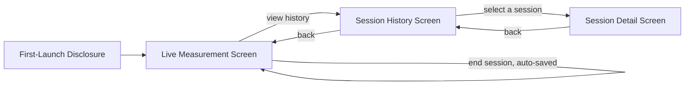

# 06_UI_GUIDELINE.md
# UI Guideline
## rPPG Desktop Vitals Monitor

---

**Document Control**

| Field | Value |
|---|---|
| Document ID | UIG-06 |
| Version | 1.0.0 |
| Status | **BINDING** — Presentation Layer Design |
| Depends On | `03_ARCHITECTURE.md` (§6.4), `04_PACKAGE_STRUCTURE.md` (§4), and — for binding content, not just structure — `01_PROJECT_VISION.md` (G2, R3), `02_SOFTWARE_REQUIREMENT.md` (§3.4, §4.3, §4.7) |
| Consumed By | `13_TESTING.md` (manual UI checklist), `15_TASK.md` |
| Precedence | Subordinate to `00`–`03`. Every requirement in `02 §3.4`, `§4.3`, and `§4.7` is realized concretely here — this document does not soften or reinterpret them, it specifies exactly how they appear on screen. |
| Maintainer | Human Project Architect — Abdi Soleh Rosadi |
| Last Updated | 2026-07-12 |

---

## 1. Purpose of This Document

`01_PROJECT_VISION.md` established that this product's credibility depends on never presenting a heart-rate number without visible uncertainty (G2, SC-5), and that a user mistaking the reading for medical-grade output is an active product risk (R3), not a hypothetical one. `02_SOFTWARE_REQUIREMENT.md` turned that into testable requirements — NFR-701, NFR-702, NFR-301–303. Neither document says what the screen actually looks like.

This document closes that gap. Every screen, state, and component described below exists to satisfy a specific requirement already established upstream — nothing here introduces new product intent, and nothing here is decorative. `13_TESTING.md`'s manual UI checklist is verified directly against this document, not against general taste.

---

## 2. Design Principles

1. **Honesty over polish.** A visually clean screen that implies more certainty than the underlying signal supports is a defect, not good design, regardless of how it looks.
2. **Guidance over silence.** Every degraded or uncertain state tells the user what to do about it (`02` FR-401–FR-403), not just that something is wrong.
3. **The confidence indicator is not decoration.** It is the single UI element this entire document exists to protect (§3).
4. **No screen showing a heart-rate value is exempt from the non-medical framing requirement** (§4) — not the live screen, not history, not a detail view, not an exported artifact's preview.
5. **Redundant encoding, not color alone.** Every state distinction (confidence tier, signal quality) is conveyed through color *and* icon *and* text label together — never color by itself (§9).

---

## 3. The Confidence Indicator — Design Requirements

This section exists solely to make `01 §8` SC-5 and `02` FR-106 unambiguous at the pixel level.

- The confidence indicator is **always rendered in the same visual group as the heart-rate value it describes** — never in a separate panel, tab, or tooltip requiring an extra action to reveal.
- Confidence is communicated in three tiers for display purposes, distinct from the raw continuous confidence score `HeartRateEstimate` carries internally (`03 §3`):

| Display Tier | Underlying Confidence Score | Color Role | Icon | Label |
|---|---|---|---|---|
| High | ≥ 0.8 | Green | Check | "Reading stable" |
| Moderate | 0.5 – 0.79 | Amber | Caution triangle | "Reading may vary — try to stay still" |
| Low | < 0.5 | Red-orange | Warning | "Low confidence — check lighting and position" |

- **A crucial distinction:** these three tiers only apply once a `HeartRateEstimate` actually exists — i.e., while `SignalQuality` is `STABLE` (`03 §3`, `02 §3.4`). While `SignalQuality` is `SEARCHING` or `DEGRADED`, no numeric estimate has been computed at all, and the screen does not show a number with a "very low" confidence badge — it shows no number, with a distinct searching/degraded treatment (§6.2). Showing a specific "Low" tier number is honest (a value was actually computed, just not trusted much); showing a number during `SEARCHING` would not be, because no value exists yet to show.
- The confidence indicator's text label is never abbreviated to just the tier name ("Low") without the accompanying guidance clause — a bare severity word with no next step violates Design Principle 2.

---

## 4. Non-Medical Framing Requirements

Realizes `00 §4` (NG-1), `01 §11` (R3), and `02` NFR-701/NFR-702.

Two layers, deliberately distinct:

**Layer 1 — First-launch disclosure.** Shown once, before the first session can be started (§6.1). Plain-language explanation that the application estimates heart rate from camera video for informational purposes, is not a medical device, and should not inform any health decision. Requires an explicit acknowledgment action to proceed. This layer *may* be dismissed for the remainder of the application's lifetime once acknowledged — it is an onboarding moment, not the persistent indicator NFR-702 requires.

**Layer 2 — Persistent footer strip.** A compact, always-visible text element — "Estimate only, not medical-grade" or equivalent wording — present on every screen that displays a heart-rate value: the Live Measurement screen, the Session History list (which shows summary HR values per row), and the Session Detail screen. This layer has **no dismiss control of any kind**. It is not a toast, not a banner with a close button, not a tooltip — it is static, persistent screen furniture, satisfying NFR-702's "not dismissible in a way that removes it for the remainder of the session" by construction rather than by configuration.

---

## 5. Screen Inventory and Navigation Flow

| Screen | Package (`04 §4`) | Primary Requirement(s) |
|---|---|---|
| First-Launch Disclosure | `presentation.javafx.dashboard` | §4 Layer 1 |
| Live Measurement | `presentation.javafx.dashboard` | `02` FR-101–FR-107, FR-401–FR-403, FR-501–FR-502 |
| Session History | `presentation.javafx.history` | `02` FR-202, FR-204 |
| Session Detail | `presentation.javafx.history` | `02` FR-203 |

Device selection (`02` FR-501, FR-502) is not a separate screen — it is an inline control on the Live Measurement screen, consistent with `02`'s "minimal form" priority for those requirements and `01 §9`'s V1 scope discipline against adding screens beyond what's committed.

---

## 6. Screen Specifications

### 6.1 First-Launch Disclosure

- Shown automatically before the Live Measurement screen on the very first run only (tracked via a local, non-network application-state flag).
- Content: what the application does, what it does not do (not a medical device, §4), and what it never transmits (`02` NFR-501–NFR-503, stated briefly here to reinforce the no-cloud, no-account premise from `01 §5` Persona B).
- A single, unambiguous acknowledgment action is required to proceed. There is no "skip" path that bypasses this screen.

### 6.2 Live Measurement Screen

Composition:

- A live camera preview with a bounding-box overlay on the detected region of interest when present — this is a transient, in-memory display only; it is never what gets persisted (`02` DR-1). Its purpose is to let the user see *why* signal quality might be poor (poor framing, backlighting) without requiring them to understand the underlying algorithm.
- The heart-rate display area, governed by the state table below.
- The confidence indicator (§3), co-located with the heart-rate display whenever a value is shown.
- Session controls: a single Start/End toggle action, and a camera device selector (`02` FR-501, FR-502).
- The non-medical footer (§4, Layer 2).

State-to-treatment mapping, directly realizing the session state model in `02 §3.4`:

| Session State | Heart-Rate Display | Confidence Indicator | Status Message |
|---|---|---|---|
| Idle | Not shown | Hidden | "Select a camera and press Start" |
| Acquiring / Searching | Placeholder (no number) | Hidden | "Finding your pulse — hold still and face the camera" |
| Measuring (window filling, pre-convergence) | Placeholder (no number) | Hidden | "Reading signal — results in a few seconds" |
| Reporting — High tier | Numeric bpm | High (§3) | "Reading stable" |
| Reporting — Moderate tier | Numeric bpm | Moderate (§3) | "Reading may vary — try to stay still" |
| Reporting — Low tier | Numeric bpm | Low (§3) | "Low confidence — check lighting and position" |
| Degraded — camera disconnected | Last known value, visually muted, with a "last updated" timestamp | Muted | "Camera disconnected — reconnect to continue" (`02` FR-401) |
| Degraded — insufficient lighting | Placeholder (no number) | Hidden | "Lighting too low — move to a brighter area" (`02` FR-402) |
| Ended | Transitions to Idle; session is saved automatically | — | "Session saved" |

### 6.3 Session History Screen

- A reverse-chronological list of sessions (`02` FR-202): date/time, duration, mean HR, mean confidence per row.
- Each row's mean HR is displayed with a compact version of the same confidence-tier encoding used on the Live Measurement screen — the tiering logic is shared, not reinvented per screen.
- A delete action per row (`02` FR-204), which requires a confirmation step before removing the record — an irreversible action never executes on a single accidental click.
- The non-medical footer (§4, Layer 2) is present.

### 6.4 Session Detail Screen

- The selected session's HR trend over its duration, rendered via XChart (`03 §4`'s note that charting is a direct Presentation-layer concern, not behind a Domain port).
- Summary statistics: duration, mean HR, mean confidence, proportion of the session spent in each confidence tier.
- The non-medical footer (§4, Layer 2) is present — a historical chart is exactly the kind of screen a user might screenshot and share out of context, which makes the persistent disclaimer here as important as on the live screen, not less.

---

## 7. Visual Design System

| Role | Indicative Color | Notes |
|---|---|---|
| High confidence | `#2E7D32` (dark green) | Chosen over a brighter, more saturated green for adequate contrast against light backgrounds. |
| Moderate confidence | `#F9A825` (amber) | |
| Low confidence / warning | `#D84315` (red-orange) | Reserved for the Low confidence tier and degraded-state messaging; not reused elsewhere as a generic "error" color, to keep its meaning consistent. |
| Searching / neutral | `#607D8B` (blue-gray) | Used for the Idle/Searching states, where no judgment about signal quality is being made yet. |

These are starting values, refinable during implementation, but the **contrast requirement is not**: all text and icon colors against their background meet WCAG 2.1 AA's minimum 4.5:1 contrast ratio for normal-sized text. A visually appealing color that fails this ratio is not an acceptable substitution.

Typography: the heart-rate numeral is the single largest text element on the Live Measurement screen — it is the screen's primary purpose, and its visual weight should reflect that unambiguously relative to every other element, including the confidence indicator itself.

---

## 8. Component-to-ViewModel Binding Conventions

Realizing `03 §6.2`'s `MeasurementObserver`-to-`Property` seam concretely:

- `LiveMeasurementViewModel` exposes one `ObservableValue`/`Property` per piece of state the view needs, named for what it represents rather than how it's computed — `currentHeartRateBpm`, `confidenceTier`, `signalStatusMessage`, `regionOfInterestOverlay`. The View binds to these directly via FXML; it never polls a value once and stores a stale copy.
- The View never calls a use case or the orchestrator directly — every action (Start, End, device selection, delete) goes through the ViewModel, consistent with `00 §24`.
- `SessionHistoryViewModel` and the Session Detail equivalent follow the same pattern independently — they do not share a ViewModel with `LiveMeasurementViewModel` merely because both display heart-rate values; they are different screens with different lifecycles.

---

## 9. Accessibility Requirements

- No state distinction (confidence tier, signal quality, degraded reason) is conveyed by color alone — every one is paired with a distinct icon shape and a text label (§3, §6.2), so the interface remains fully interpretable for colorblind users.
- All interactive controls (Start/End toggle, device selector, history list rows, delete action) are keyboard-navigable via JavaFX's standard focus traversal — this is verified, not assumed, per `13_TESTING.md`'s manual checklist.
- The confidence indicator and the non-medical footer text are exposed to assistive technology via JavaFX's accessibility API, at minimum — these are the two most safety-relevant text elements in the entire application and are not permitted to be accessibility afterthoughts.
- Minimum font size for the heart-rate numeral and status messages ensures legibility at a normal desktop viewing distance without requiring the user to lean toward the screen.

---

## 10. Relationship to Other Documents

| Document | What It Inherits From This Document |
|---|---|
| `13_TESTING.md` | The manual UI checklist is verified directly against §6's screen specifications and §9's accessibility requirements. |
| `15_TASK.md` | UI implementation tasks are scoped per screen (§6), not as one undifferentiated "build the UI" item. |

---

## 11. Revision History

| Version | Date | Change |
|---|---|---|
| 1.0.0 | 2026-07-12 | Initial ratified version, derived from `01_PROJECT_VISION.md`, `02_SOFTWARE_REQUIREMENT.md`, and `03_ARCHITECTURE.md`, all v1.0.0. |

---

*End of 06_UI_GUIDELINE.md. Subordinate to `00`–`03`; binding on all documents listed in §10.*