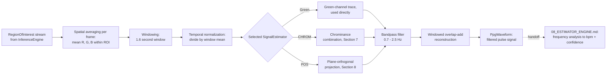

# 07_SIGNAL_PROCESSING.md
# Signal Processing
## rPPG Desktop Vitals Monitor

---

**Document Control**

| Field | Value |
|---|---|
| Document ID | SIG-07 |
| Version | 1.0.0 |
| Status | **BINDING** — Domain Algorithm Specification |
| Depends On | `03_ARCHITECTURE.md` (§3, §4, §6.1) |
| Consumed By | `08_ESTIMATOR_ENGINE.md`, `12_PERFORMANCE.md` |
| Precedence | Subordinate to `03_ARCHITECTURE.md`. This document specifies the internal mathematics of `domain.signal` and the extraction stage of `domain.estimation` (`04 §4`) — it does not alter any port or component boundary already established there. |
| Maintainer | Human Project Architect — Abdi Soleh Rosadi |
| Last Updated | 2026-07-12 |

---

## 1. Purpose of This Document

`03_ARCHITECTURE.md` names `SignalEstimator` and its three implementations — `PosSignalEstimator`, `ChromSignalEstimator`, `GreenChannelSignalEstimator` — without specifying what any of them actually compute. This document is that specification: the exact, published, peer-reviewed mathematics each implementation is built from, plus the domain vocabulary (`00 §23`) used consistently everywhere else in this document set.

Nothing in this document is original research. Every algorithm below is a documented, cited, established technique from the rPPG literature (§12). This project's contribution is engineering discipline in implementing them, not inventing new signal processing — consistent with `01 §4` (Non-Goal NG-5, favoring validated techniques over novelty).

`08_ESTIMATOR_ENGINE.md` picks up exactly where this document ends: it takes the filtered pulse waveform this document specifies and turns it into a numeric heart-rate value with a confidence score (§11).

---

## 2. Domain Glossary

Canonical terminology, binding across all documents in this set per `00 §23`:

| Term | Definition |
|---|---|
| ROI | Region of Interest — the facial skin area (§4) from which color signal is sampled. |
| rPPG | Remote photoplethysmography — inferring blood-volume-driven color change from a camera at a distance, without skin contact. |
| BVP | Blood Volume Pulse — the underlying physiological waveform rPPG algorithms attempt to recover; also used for the recovered signal itself once extracted. |
| PPG | Photoplethysmography — the general family of techniques (contact or remote) that infer cardiovascular signal from light absorption/reflection changes in tissue. |
| HR | Heart Rate, in beats per minute (bpm). |
| HRV | Heart Rate Variability — variation in the time interval between successive heartbeats; not a V1-committed feature (`01 §9`) but the glossary is fixed now to avoid renaming later. |
| SNR | Signal-to-Noise Ratio — used in `08_ESTIMATOR_ENGINE.md`'s confidence scoring. |
| fps | Frames per second. |
| bpm | Beats per minute. |

---

## 3. Pipeline Overview

This document owns everything up to and including `WAVE` — a clean, filtered, single-channel pulse waveform. `08_ESTIMATOR_ENGINE.md` owns everything after the handoff point: turning that waveform into a `HeartRateEstimate`.

---

## 4. Region of Interest and Spatial Averaging

`InferenceEngine` (`03 §4`, detailed in `09_AI_INTEGRATION.md`) supplies a `RegionOfInterest` per frame — the facial skin area used for sampling. Following established rPPG practice, the ROI targets the forehead and/or cheek regions specifically: these areas combine strong capillary perfusion with comparatively low likelihood of occlusion (facial hair, glasses) or large deformation from expression changes, compared to using the entire detected face bounding box indiscriminately.

For each frame, this stage produces one `PpgSample` (`03 §3`) by computing the spatial mean pixel value within the ROI, independently per color channel: mean red, mean green, mean blue. This is the `[x_r, x_g, x_b]` triple referenced throughout §6–§9.

---

## 5. Windowing and Temporal Normalization

`PpgSample`s accumulate into a `PpgWaveform` (`03 §3`) using a sliding window of **1.6 seconds** — consistent across all three algorithms, following the published parameterization for CHROM and POS (§12, refs 2, 3). At a 30 fps capture rate (`00 §11`), this is a 48-frame window.

Within each window, every channel's samples are normalized by dividing by that channel's mean value over the window — `[x̄_r, x̄_g, x̄_b]`. This temporal normalization is what makes the subsequent algorithms insensitive to a subject's overall skin tone and to slowly-varying ambient illumination intensity; only the *relative* fluctuation within the window carries pulse information.

Window advance differs slightly per algorithm, per their respective source publications:

| Algorithm | Window Step | Effective Overlap |
|---|---|---|
| CHROM | 0.8 seconds | 50% |
| POS | 1 frame | ~97% (near-continuous) |
| Green-channel | 1 frame | ~97% (near-continuous; no published standard step, POS's convention is reused for consistency) |

---

## 6. Algorithm A — Green-Channel Method

**Reference:** Verkruysse, W., Svaasand, L. O., & Nelson, J. S. (2008). Remote plethysmographic imaging using ambient light. *Optics Express*, 16(26), 21434–21445.

**Principle.** The green channel carries the strongest plethysmographic signal of the three RGB channels, because it corresponds most closely to an absorption peak of (oxy-)hemoglobin — the pulsatile blood volume change is more visible in green than in red or blue.

**Method.** The normalized green channel trace, `x̄_g`, is used directly as the candidate pulse signal, passed straight to the shared bandpass filtering stage (§9). No cross-channel combination is performed — this is what makes it the simplest of the three implementations, and the appropriate baseline / fallback `SignalEstimator`.

**Trade-off.** Simplicity and low computational cost, at the price of no explicit motion-artifact suppression — the red and blue channels, which CHROM and POS use to cancel out illumination and motion artifacts common to all channels, are discarded entirely.

---

## 7. Algorithm B — CHROM (Chrominance-Based) Method

**Reference:** De Haan, G., & Jeanne, V. (2013). Robust pulse rate from chrominance-based rPPG. *IEEE Transactions on Biomedical Engineering*, 60(10), 2878–2886.

**Principle.** CHROM assumes a standardized skin-color profile to white-balance the frame, then combines the three channels into two chrominance signals specifically designed so that specular reflection and motion artifacts — which affect all three channels similarly — cancel out in the combination, while the pulsatile component (which affects the channels differently, per the skin's optical absorption spectrum) survives.

**Method.** Using the window-normalized, bandpass-filtered channel traces `[y_r, y_g, y_b]` (filtering applied before this combination step, using the same 0.7–2.5 Hz passband as §9):

- Two intermediate chrominance combinations are computed: `A = 3·y_r − 2·y_g` and `B = 1.5·y_r + y_g − 1.5·y_b`.
- An alpha weight is computed as the ratio of the standard deviations of the filtered `A` and `B` signals over the window: `α = σ(A) / σ(B)`.
- The final CHROM signal for the window is: `S = 3·(1 − α/2)·y_r − 2·(1 + α/2)·y_g + (3α/2)·y_b`.
- Each windowed output is scaled by a Hanning window and combined with the adjacent window using overlap-add (§9), consistent with the 50% overlap in §5's table.

**Trade-off.** Substantially more robust to specular reflection and mild motion than the green-channel method, at modest extra computational cost; the standardized-skin-tone assumption is an approximation that can be violated under strongly non-white illumination, which is why POS (§8) improves on it further.

---

## 8. Algorithm C — POS (Plane-Orthogonal-to-Skin) Method

**Reference:** Wang, W., den Brinker, A. C., Stuijk, S., & de Haan, G. (2017). Algorithmic principles of remote PPG. *IEEE Transactions on Biomedical Engineering*, 64(7), 1479–1491.

**Principle.** POS derives, from a physiologically-motivated optical model of skin reflectance, a projection plane orthogonal to the normalized skin-tone direction in RGB space. Projecting the temporal signal onto this plane removes intensity variation (including much motion-induced variation) by construction, rather than relying on chrominance combinations tuned empirically.

**Method.** Using the window-normalized channel traces `[x̄_r, x̄_g, x̄_b]` (§5):

- Two projected signals are computed: `Xs = x̄_g − x̄_b` and `Ys = −2·x̄_r + x̄_g + x̄_b`.
- An alpha weight is computed as the ratio of the standard deviations of `Xs` and `Ys` over the window: `α = σ(Xs) / σ(Ys)`.
- The final POS signal for the window is: `S = Xs + α·Ys`.
- Windowed outputs are combined via overlap-add (§9) at the near-continuous step size in §5's table.

**Trade-off.** Generally reported in the literature as outperforming both the green-channel method and CHROM, particularly under motion, at the cost of being the most computationally involved of the three and the least trivial to reason about intuitively when debugging a poor reading.

---

## 9. Shared Bandpass Filtering and Windowed Reconstruction

Regardless of which algorithm produced the candidate pulse signal, the same filtering and reconstruction stage applies:

- A zero-phase, 3rd-order Butterworth bandpass filter with passband **0.7–2.5 Hz** (42–150 bpm) is applied. This range comfortably covers resting-to-moderately-elevated adult heart rate, consistent with the desktop, seated-use assumption in `01 §10` (A1, A2); it is not tuned for vigorous-exercise heart rates, which is out of scope per `01 §4` (this project targets a seated desktop user, not a fitness-tracking use case).
- Filtered, per-window outputs are combined into the continuous `PpgWaveform` using overlap-add, weighted by a Hanning window at the boundaries to avoid discontinuities where adjacent windows meet.
- The resulting waveform is what crosses the handoff boundary in §3 to `08_ESTIMATOR_ENGINE.md`.

---

## 10. Algorithm Comparison and Selection Guidance

| Algorithm | Robustness to Motion | Computational Cost | Recommended Role |
|---|---|---|---|
| Green-channel | Low | Lowest | Fallback / baseline; useful when the user is nearly motionless and lighting is good. |
| CHROM | Moderate–High | Moderate | Reasonable default for typical desktop conditions (seated, minor movement). |
| POS | Highest | Highest | Preferred when maximum robustness is needed and the modest extra computation is acceptable. |

This table informs — but does not itself decide — which `SignalEstimator` implementation ships as the V1 default; that decision, along with any runtime algorithm-switching behavior, is `08_ESTIMATOR_ENGINE.md`'s responsibility, since it depends on confidence-scoring behavior this document does not define.

---

## 11. Handoff to 08_ESTIMATOR_ENGINE.md

At the boundary marked in §3, `08_ESTIMATOR_ENGINE.md` receives a filtered, continuous `PpgWaveform` and is responsible for:

- Frequency-domain analysis (e.g., FFT or autocorrelation-based peak detection) to convert the waveform into a bpm value.
- Confidence scoring, using signal characteristics such as spectral peak sharpness and SNR (§2).
- The `SignalQuality` state transition rules first introduced in `02 §3.4` and referenced structurally in `03 §6.1`.

This document does not anticipate or duplicate any of that logic — the boundary is deliberate, per §1.

---

## 12. References

1. Verkruysse, W., Svaasand, L. O., & Nelson, J. S. (2008). Remote plethysmographic imaging using ambient light. *Optics Express*, 16(26), 21434–21445.
2. De Haan, G., & Jeanne, V. (2013). Robust pulse rate from chrominance-based rPPG. *IEEE Transactions on Biomedical Engineering*, 60(10), 2878–2886.
3. Wang, W., den Brinker, A. C., Stuijk, S., & de Haan, G. (2017). Algorithmic principles of remote PPG. *IEEE Transactions on Biomedical Engineering*, 64(7), 1479–1491.

---

## 13. Relationship to Other Documents

| Document | What It Inherits From This Document |
|---|---|
| `08_ESTIMATOR_ENGINE.md` | Receives the filtered `PpgWaveform` at the §3/§11 handoff and owns everything downstream of it. |
| `12_PERFORMANCE.md` | The per-window computational cost comparison in §10 informs the benchmark targets for each `SignalEstimator` implementation. |

---

## 14. Revision History

| Version | Date | Change |
|---|---|---|
| 1.0.0 | 2026-07-12 | Initial ratified version, derived from `03_ARCHITECTURE.md` v1.0.0 and the cited published literature (§12). |

---

*End of 07_SIGNAL_PROCESSING.md. Subordinate to `03_ARCHITECTURE.md`; binding on all documents listed in §13.*