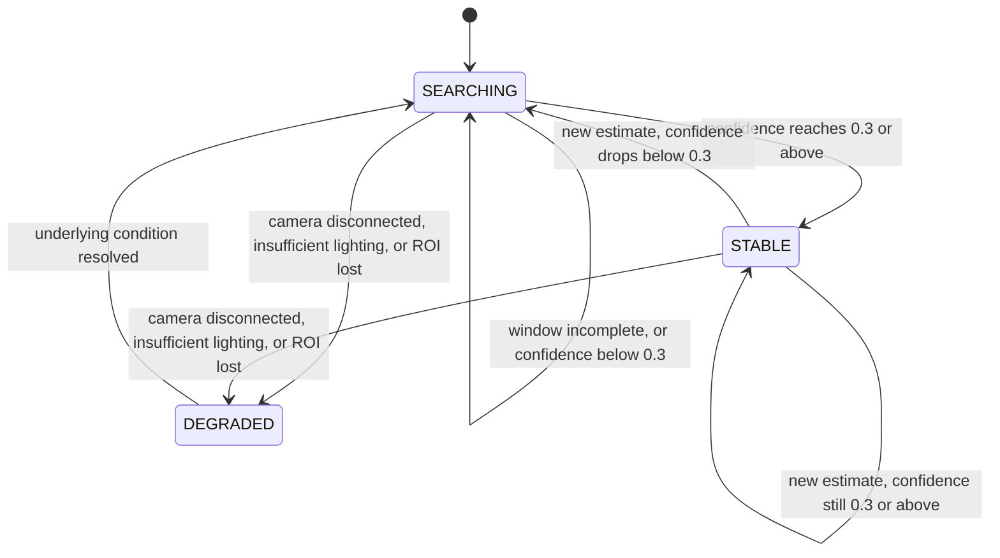

# 08_ESTIMATOR_ENGINE.md
# Estimator Engine
## rPPG Desktop Vitals Monitor

---

**Document Control**

| Field | Value |
|---|---|
| Document ID | EST-08 |
| Version | 1.0.0 |
| Status | **BINDING** — Domain Algorithm Specification |
| Depends On | `07_SIGNAL_PROCESSING.md` (§3, §11), `03_ARCHITECTURE.md` (§3, §6.1), `02_SOFTWARE_REQUIREMENT.md` (§3.4) |
| Consumed By | `06_UI_GUIDELINE.md` (§3, §6.2's confidence tiers already assume this document's floor/tier boundaries), `12_PERFORMANCE.md` |
| Precedence | Subordinate to `07_SIGNAL_PROCESSING.md`. This document begins exactly where that one ends (`07 §11`) and does not redefine anything upstream of the filtered `PpgWaveform` handoff. |
| Maintainer | Human Project Architect — Abdi Soleh Rosadi |
| Last Updated | 2026-07-12 |

---

## 1. Purpose of This Document

`07_SIGNAL_PROCESSING.md` produces a clean, filtered, continuously-reconstructed pulse waveform and explicitly stops there (`07 §11`). This document is everything downstream of that handoff: turning the waveform into a numeric heart-rate value, deciding how much to trust that value, and formalizing the `SignalQuality` state machine that `03 §6.1` and `02 §3.4` both refer to but do not themselves define precisely.

`06_UI_GUIDELINE.md §3` already committed to specific confidence-tier boundaries (High ≥ 0.8, Moderate 0.5–0.79, Low below that) and to the rule that no number is shown below a certain floor. This document is where those boundaries are actually derived and justified, not merely asserted a second time.

---

## 2. Frequency-Domain Estimation Method

**Analysis window.** Estimation operates on an **8-second sliding window** (240 samples at the 30 fps target in `00 §11`) taken from the continuously-reconstructed `PpgWaveform` that `07 §9` produces — this is distinct from, and longer than, the 1.6-second *extraction* window used inside the CHROM/POS/Green-channel algorithms themselves (`07 §5`). The longer analysis window exists purely to give the frequency estimate enough data to be precise; it does not change how the pulse signal itself was extracted or filtered.

**Update cadence.** A new estimate is computed once per second, sliding the 8-second analysis window forward — this satisfies the "continuously updating, near-real-time" requirement in `02` FR-105 without requiring frequency analysis on every single frame, which would be wasted computation given heart rate cannot meaningfully change faster than that.

**Method.**

1. The 240-sample analysis window is zero-padded to **1,024 samples** before applying an FFT (Apache Commons Math's `FastFourierTransformer`, per `00 §16`, which requires a power-of-two input length — 1,024 satisfies this). Zero-padding is necessary, not cosmetic: the window's native frequency resolution (`fs / N` = 30 Hz / 240 ≈ 0.125 Hz ≈ 7.5 bpm per bin) is too coarse for a meaningful heart-rate readout; zero-padding to 1,024 samples improves resolution to `30 / 1024` ≈ 0.029 Hz ≈ **1.76 bpm per bin**, which is acceptable.
2. The magnitude spectrum is searched for its maximum value restricted to the **0.7–2.5 Hz** band — the same physiological passband already established in `07 §9`, searched again here rather than assumed, since the bandpass filter suppresses energy outside this range but does not guarantee the *global* spectral maximum falls inside it under a badly corrupted window.
3. The frequency at the located peak, `f_peak` (Hz), converts directly to the heart-rate estimate: `bpm = f_peak × 60`.

---

## 3. Confidence Scoring Methodology

The confidence score attached to every `HeartRateEstimate` (`03 §3`) is a weighted combination of three components, each independently justified:

| Component | What It Measures | Rationale |
|---|---|---|
| Spectral SNR | Ratio of spectral power within a narrow band around `f_peak` (± 0.1 Hz) to the remaining power in the 0.7–2.5 Hz band. | A sharp, isolated peak indicates a genuine periodic signal; a flat or multi-peaked spectrum indicates noise dominating the window. This general technique — an SNR metric computed from the pulse spectrum — is the same class of quality measure used in the original CHROM reference implementation (`07 §12`, ref. 2). |
| Temporal consistency | How closely the current window's `bpm` estimate agrees with the previous window's (e.g., within a small tolerance), scored lower as the discrepancy grows. | Heart rate does not physiologically change by a large amount within one second; a large jump between consecutive estimates is far more likely to indicate a bad window than a real physiological event. |
| ROI stability | The `RegionOfInterest` detection confidence (`03 §3`) averaged over the analysis window. | A poorly tracked or partially occluded ROI degrades the extracted signal even before it reaches frequency analysis, and this component surfaces that upstream cause directly rather than only its downstream symptom. |

The three components are combined into a single confidence score in `[0, 1]`; the exact weighting is an implementation-tunable parameter, not fixed by this document, but is documented and versioned wherever it is configured, per `00 §17`.

**A note on convergence.** This document deliberately does not define a separate "convergence" mechanism distinct from the confidence score itself. The temporal-consistency component has no prior estimate to compare against for the very first window of a session, and necessarily scores low until several consecutive windows agree — which is exactly the behavior a convergence mechanism would try to hand-build separately. `SignalQuality` naturally stays `SEARCHING` (§4) until the signal has proven itself consistent across multiple one-second updates, which comfortably fits within the 15-second convergence target in `00 §11` for a clean signal, without a redundant bolt-on rule.

**Display floor and tiers.** `06_UI_GUIDELINE.md §3`'s tier boundaries are defined against this score:

| Confidence Score | Treatment |
|---|---|
| < 0.3 | Below the display floor — no numeric estimate is surfaced; `SignalQuality` is `SEARCHING` even if a raw value was technically computed internally (`06 §3`'s distinction between "no value yet" and "a value that isn't trusted"). |
| 0.3 – 0.49 | Low tier (`06 §3`) — value shown, tier badge and guidance message shown. |
| 0.5 – 0.79 | Moderate tier (`06 §3`). |
| ≥ 0.8 | High tier (`06 §3`). |

---

## 4. The SignalQuality State Machine

This is the authoritative definition `03 §6.1` refers to, narrower in scope than the full session lifecycle already defined in `02 §3.4` (which governs the whole session, including states like `Idle` and `Ended` that have nothing to do with signal quality specifically).

`STABLE` corresponds to `02 §3.4`'s `Reporting` state; `SEARCHING` corresponds to `Acquiring`/`Searching`; `DEGRADED` corresponds to `Degraded`. The two diagrams describe the same system at different levels of detail and must never be edited independently of one another — a change to one that isn't reflected in the other is a documentation defect per `00 §17`.

---

## 5. Exception Taxonomy for Signal States

Consistent with `00 §22.1`'s rule that normal-but-uncertain outcomes are typed results, not thrown exceptions:

- **Not an exception:** no face detected, low confidence, an entire `SEARCHING` window — all of these are represented as data (`SignalQuality` values, a low confidence score), never as a thrown `SignalQualityException`. This is deliberate: at a one-second estimation cadence and a 30 fps capture cadence, treating routine signal absence as exceptional control flow would both violate `00 §22.1` and be needlessly expensive.
- **`SignalQualityException` is reserved for genuinely anomalous internal failures** of the estimation math itself — for example, a degenerate all-zero or numerically invalid analysis window producing a division-by-zero in the alpha-weighting step shared by CHROM and POS (`07 §7`, `07 §8`). This is a programmer-error-adjacent edge case (`00 §22.1`), not a routine operational state, and is the only circumstance under which this exception type is thrown from within the estimation pipeline.
- **`CameraUnavailableException`** and other infrastructure-originated exceptions are thrown by their respective adapters (`03 §6.3`), not by the estimator — the estimator only ever *reacts* to a `DEGRADED` `SignalQuality` transition (§4) caused by such an exception being caught and translated upstream, per the sequence already specified in `03 §7.2`.

---

## 6. Algorithm Selection for V1

Per `07 §10`'s comparison, **CHROM** ships as the V1 default `SignalEstimator` implementation — the reasonable middle ground of robustness and computational cost for the seated, desktop-use assumptions in `01 §10` (A1, A2). `PosSignalEstimator` and `GreenChannelSignalEstimator` are fully implemented behind the same port (`03 §4`) and available for use, but algorithm selection is a build/configuration-level decision for V1, not a runtime, user-facing feature — introducing an in-app algorithm switcher is Post-V1 scope, since it was never a committed requirement in `02 §3` and adding it here would be `01 §9` scope creep smuggled in through an implementation document.

---

## 7. Relationship to Other Documents

| Document | What It Inherits From This Document |
|---|---|
| `06_UI_GUIDELINE.md` | The exact confidence-score boundaries backing its tier system (§3) and the `SignalQuality` states backing its state-to-treatment table (`06 §6.2`) are defined here, not merely referenced there. |
| `12_PERFORMANCE.md` | The once-per-second, zero-padded FFT estimation cadence (§2) is the concrete workload that document's benchmark targets must account for. |

---

## 8. Revision History

| Version | Date | Change |
|---|---|---|
| 1.0.0 | 2026-07-12 | Initial ratified version, derived from `07_SIGNAL_PROCESSING.md` v1.0.0. |

---

*End of 08_ESTIMATOR_ENGINE.md. Subordinate to `07_SIGNAL_PROCESSING.md`; binding on all documents listed in §7.*