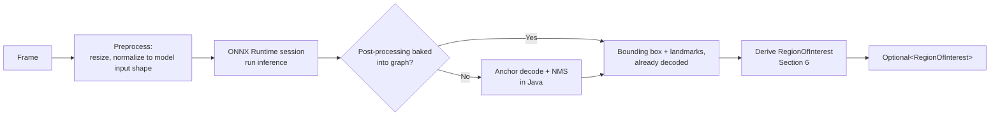

# 09_AI_INTEGRATION.md
# AI Integration
## rPPG Desktop Vitals Monitor

---

**Document Control**

| Field | Value |
|---|---|
| Document ID | AII-09 |
| Version | 1.0.0 |
| Status | **BINDING** — Infrastructure Adapter Specification |
| Depends On | `00_MASTER_PROMPT.md` (§31), `03_ARCHITECTURE.md` (§4, §6.3) |
| Consumed By | `12_PERFORMANCE.md` |
| Precedence | Subordinate to `00_MASTER_PROMPT.md §31`, which this document is required to resolve, not reinterpret. The isolation requirement stated there is binding regardless of which option this document selects. |
| Maintainer | Human Project Architect — Abdi Soleh Rosadi |
| Last Updated | 2026-07-12 |

---

## 1. Purpose of This Document

`00_MASTER_PROMPT.md §31` identified a real architectural constraint — MediaPipe has no first-party desktop-JVM API — and left two options open: (a) MediaPipe-exported models executed through ONNX Runtime, or (b) an isolated native/process boundary. It explicitly deferred the concrete choice to this document. This document makes that choice, states why, and specifies exactly what `OnnxInferenceEngine` (`03 §6.3`) must do — not just which library it uses.

---

## 2. The Integration Strategy Decision

**Decision: Option (a).** `OnnxInferenceEngine` executes ONNX-format models derived from MediaPipe's published face detection (BlazeFace) and face landmark (Face Mesh) models, entirely through ONNX Runtime's Java API, within the same JVM process as the rest of the application.

**Why not Option (b).** A JNI bridge to MediaPipe's C++ framework, or a subprocess running MediaPipe's Python API, both work technically, but both introduce cost disproportionate to this project's scale: JNI requires compiling and maintaining a native bridge per target platform (`00 §26`'s native-library caution applies doubly here); a subprocess requires bundling and managing a second runtime (Python) inside the desktop installer (`14_DEPLOYMENT.md`), and an inter-process communication channel that the threading model in `00 §15` was not designed around. Option (a) keeps the entire pipeline inside the single-process, virtual-thread-based architecture already established, at the cost of a one-time model-conversion step instead of an ongoing runtime cost.

**Why option (a) is credible, not just convenient.** Converting MediaPipe's TFLite-format models to ONNX is not a novel or unproven idea for this project to attempt first — it is a well-trodden path. Multiple independent open-source projects have published working ONNX conversions of both BlazeFace and Face Mesh, including "end-to-end" variants that bake the anchor-decoding and non-maximum-suppression post-processing directly into the exported ONNX graph, removing the need to reimplement that logic in Java by hand. This precedent is why option (a) is treated as low-risk engineering rather than a research spike.

---

## 3. Model Selection Criteria

This document does not pin one specific model file or repository — that is an implementation-time task (`15_TASK.md`), because published community conversions are informally maintained artifacts, not versioned releases this governance document should hard-bind to. Whoever performs that task selects a model meeting all of the following:

| Criterion | Requirement |
|---|---|
| Detection capability | Face bounding box, at minimum; landmark points sufficient to derive the forehead/cheek ROI required by `07 §4`. |
| Post-processing | Prefer an "end-to-end" export with anchor decoding and non-maximum suppression already included in the ONNX graph, minimizing custom Java-side post-processing and its associated bug surface. |
| Validation | The chosen model's output is validated against a small set of reference images with known face positions before being adopted — an unvalidated third-party conversion is not trusted by default. |
| License | The model's license (and, separately, the license of whoever performed the conversion, if different from MediaPipe's own) is verified compatible with this project, per `00 §16`'s dependency-addition rule. |
| Performance | Inference latency fits within the per-frame budget apportioned in `12_PERFORMANCE.md`, measured on the reference hardware, not assumed from the model's advertised size. |

---

## 4. Known Risks in Model Conversion

TFLite-to-ONNX conversion of MediaPipe's models is well-precedented (§2) but not risk-free — operator-compatibility failures between TFLite's and ONNX's op sets are a documented, real occurrence specifically for MediaPipe's face landmark model, not a hypothetical concern. This is exactly why §3 prefers an already-converted, already-validated community artifact over performing a fresh conversion in-house: re-deriving a conversion that others have already hit and solved compatibility issues on is wasted risk. If no suitable pre-converted, adequately licensed model can be found at implementation time, the fallback is either (a) performing the conversion in-house and budgeting explicit time for op-compatibility debugging, or, if that proves infeasible, (b) revisiting Option (b) from §2 via `00 §8`'s decision process — this document's preference for Option (a) is a strong default, not an unconditional mandate.

---

## 5. InferenceEngine Contract

Restating and completing `03 §4`'s port entry with the detail an implementer needs:

- **Input:** one `Frame` (`03 §3`) per invocation.
- **Output:** `Optional<RegionOfInterest>` — present when a face is detected with sufficient confidence, empty otherwise. Consistent with `00 §22.2` and `05 §7`: the "no face detected" case is a typed, empty result, never a thrown exception and never `null`.
- **`RegionOfInterest` fields** (`03 §3`) are populated as: a bounding box derived from the detector output; a detection confidence score taken directly from the model's own output confidence; and a landmark reference sufficient for §6's ROI derivation.
- **Failure modes that *are* exceptional:** a corrupted or unexpectedly-shaped input tensor, or an ONNX Runtime execution failure, throws `ModelInferenceException` (`00 §22.2`) — this is categorically different from "no face this frame," which is not an error at all.

---

## 6. ROI Derivation from Landmarks

A full landmark set (potentially hundreds of points, depending on the chosen model per §3) is more detail than `07 §4`'s forehead/cheek ROI needs. `OnnxInferenceEngine` derives the final ROI by:

1. Selecting the subset of landmark points corresponding to the forehead and cheek regions specifically, per `07 §4`'s guidance — not the full face bounding box, and explicitly excluding the eye and mouth regions, which move substantially with blinking and speech and would inject motion artifact directly into the signal `07_SIGNAL_PROCESSING.md` extracts.
2. Computing a bounding region from that landmark subset for each frame.
3. Applying light temporal smoothing to the derived ROI's position and size across consecutive frames — a jittery, frame-to-frame-unstable ROI box degrades the spatial averaging step in `07 §4` even when face detection itself is accurate, and this smoothing is a direct, low-cost mitigation.

The specific landmark indices used depend on the model selected per §3 and are recorded alongside that selection as implementation detail, not fixed by this document.

---

## 7. Runtime Inference Pipeline

- The ONNX Runtime session is created **once**, at `OnnxInferenceEngine` construction (loading the model file into memory) — never recreated per frame. Session creation is a comparatively expensive operation and belongs in the cold-start budget (`00 §11`), not the steady-state per-frame budget.
- Each `detectRegionOfInterest` call reuses that session. Given the architecture's threading model (`00 §15`, `03 §7.1`) already serializes frame processing through the `LiveMeasurementOrchestrator`'s pipeline on a dedicated line of execution, `OnnxInferenceEngine` does not need to independently solve concurrent multi-threaded access to a single session for V1 — it is only ever called from that one place, sequentially, per frame.
- Model file location and any versioning are configuration, not code, consistent with `00 §17`.

---

## 8. Fallback and Failure Modes

| Failure | Classification | Response |
|---|---|---|
| Model file missing or fails to load at startup | Configuration failure | `ConfigurationException` (`00 §22.2`), thrown at application startup, fails fast rather than deferring to first use. |
| No face detected in a given frame | Normal, expected outcome | `Optional.empty()` — not an error (§5). |
| Corrupted frame data or unexpected tensor shape reaches the model | Exceptional | `ModelInferenceException` (§5), caught and translated at the adapter boundary per `00 §22.1`, surfacing as a `DEGRADED` `SignalQuality` transition (`08 §4`) rather than crashing the session. |
| Chosen ONNX model's accuracy degrades under conditions not covered by §3's validation set | Product risk, not a code defect | Tracked as a `15_TASK.md` item for revalidation or model replacement, not silently patched around in the estimator. |

---

## 9. Relationship to Other Documents

| Document | What It Inherits From This Document |
|---|---|
| `12_PERFORMANCE.md` | The inference-latency budget referenced in §3 and the session-reuse behavior in §7 are the concrete workload that document's per-component performance targets must account for. |

---

## 10. Revision History

| Version | Date | Change |
|---|---|---|
| 1.0.0 | 2026-07-12 | Initial ratified version, resolving `00_MASTER_PROMPT.md §31`'s deferred integration-strategy decision. |

---

*End of 09_AI_INTEGRATION.md. Subordinate to `00_MASTER_PROMPT.md §31` and `03_ARCHITECTURE.md`; binding on all documents listed in §9.*