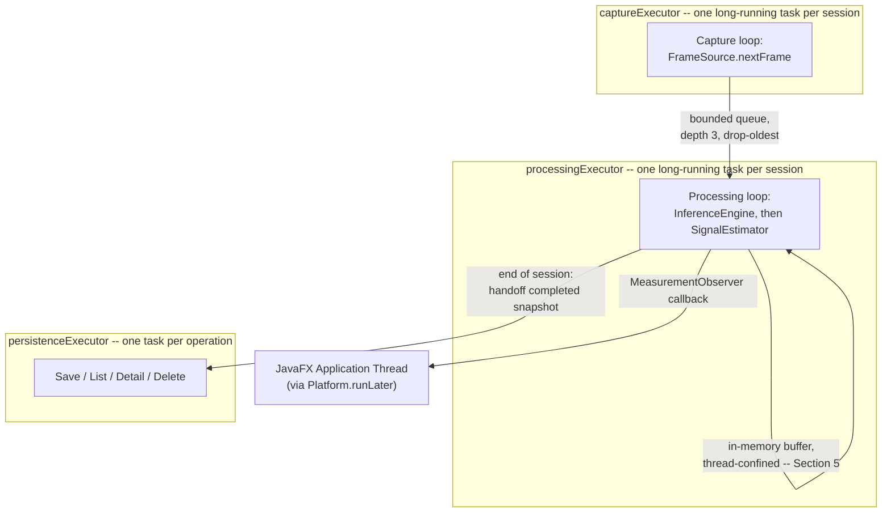

# 11_THREADING.md
# Threading Model
## rPPG Desktop Vitals Monitor

---

**Document Control**

| Field | Value |
|---|---|
| Document ID | THR-11 |
| Version | 1.0.0 |
| Status | **BINDING** — Concurrency Implementation Specification |
| Depends On | `00_MASTER_PROMPT.md` (§15, §25), `03_ARCHITECTURE.md` (§6.2, §7.1) |
| Consumed By | `12_PERFORMANCE.md` |
| Precedence | Subordinate to `00_MASTER_PROMPT.md §15`. Every concrete decision below exists to satisfy that section's philosophy, not to replace it. |
| Maintainer | Human Project Architect — Abdi Soleh Rosadi |
| Last Updated | 2026-07-12 |

---

## 1. Purpose of This Document

`00_MASTER_PROMPT.md §15` establishes the threading *philosophy* — virtual threads by default, explicit backpressure, no raw `Thread` creation. `03_ARCHITECTURE.md §7.1` shows the pipeline's happy-path sequence but stops short of naming executors, queue sizes, or shutdown order. This document supplies exactly that: the concrete topology `LiveMeasurementOrchestrator` (`03 §6.2`) is actually built from.

---

## 2. Executor Topology

Three named, purpose-specific executors — never a single undifferentiated shared pool, so that lifecycle and failure of one pipeline stage is never confused with another's:

| Executor | Backing | Task Shape |
|---|---|---|
| `captureExecutor` | `Executors.newVirtualThreadPerTaskExecutor()` | **One long-running task per active session** — a loop that calls `FrameSource.nextFrame()` repeatedly, not one task per frame. |
| `processingExecutor` | `Executors.newVirtualThreadPerTaskExecutor()` | **One long-running task per active session** — a loop consuming from the capture queue (§4), calling `InferenceEngine` then `SignalEstimator` per frame/window. |
| `persistenceExecutor` | `Executors.newVirtualThreadPerTaskExecutor()` | **One discrete task per operation** — save, list, detail, delete (`10 §9`) — genuinely independent operations, unlike the two loop-shaped executors above. |

The JavaFX Application Thread is not part of this topology — it is JavaFX's own, pre-existing thread, reached only via `Platform.runLater` (§9).

---

## 3. Pipeline Stage-to-Thread Mapping

Capture and Processing are deliberately **not** merged into a single loop, even though `03 §7.1`'s sequence diagram shows them as adjacent steps: capture blocks on genuine I/O (waiting on the camera driver), while processing is CPU-bound (inference, signal math). Separating them means a momentary camera-driver stall does not stall signal processing of already-captured frames sitting in the queue, and vice versa.

---

## 4. Queue Design and Backpressure

A single bounded queue sits between `captureExecutor` and `processingExecutor`, backed by a standard JDK concurrent queue implementation (`java.util.concurrent.ArrayBlockingQueue` or equivalent) — never a hand-rolled synchronized wrapper, per `00 §15`'s explicit-concurrent-collections rule.

- **Depth: 3 frames.** At the 30 fps target (`00 §11`), this bounds queuing latency to roughly 100 ms in the worst case — directly matched to the camera-to-display latency target in `00 §11`, not chosen arbitrarily.
- **Policy: drop-oldest.** If processing falls behind and the queue is full, the oldest queued frame is discarded to make room for the newest capture, rather than blocking the capture loop or growing the queue unboundedly. A live heart-rate display should always be showing the most recent reality available, not working through a backlog of stale frames.
- **No queue exists between Processing and Persistence.** `10_DATABASE.md §6` already established that samples are accumulated in memory and written in a single end-of-session transaction — there is nothing to queue; there is a single handoff of a completed, immutable snapshot at one specific point in time (§5).
- **No custom queue exists between Processing and the UI.** `MeasurementObserver` callbacks (§9) are invoked once per second (`08 §2`), and `Platform.runLater`'s own internal event queue is more than sufficient for that cadence — adding a second, custom queue on top would be unjustified complexity for a problem JavaFX already solves.

---

## 5. Thread Confinement and Safety Boundaries

Restating `00 §25` concretely for this pipeline's actual data:

- `Frame`, `RegionOfInterest`, `PpgSample`, and `HeartRateEstimate` are immutable records (`03 §3`) — safe to hand across the capture→processing queue with no synchronization concerns beyond the queue itself.
- The **in-session sample buffer** (`10 §6`) is **thread-confined to `processingExecutor`'s task** — only that single long-running task ever appends to it during a live session, and nothing reads it until the session ends. Because of this confinement, it is implemented as a plain `ArrayList`, not a concurrent collection; introducing thread-safety machinery here would be solving a problem that does not exist, per `00 §7`'s no-premature-abstraction principle.
- At session end, that buffer is handed to `persistenceExecutor` as a **completed, no-longer-mutated snapshot** — ownership transfers cleanly at one point in time, rather than the two threads ever concurrently touching the same list.

---

## 6. Scoped Value Usage

Per `00 §15` and `00 §27`, a single Scoped Value carries the active session's correlation identifier (`00 §18`), declared once in `application.usecase.measurement` (`05 §6`).

Because Structured Concurrency remains a preview feature and is not used in shipped code (`00 §27`), the Scoped Value binding does **not** automatically propagate across the executor boundaries in §2 — a Scoped Value binding is visible only within the dynamic scope of the thread that established it. Consequently, **each** of `captureExecutor`'s and `processingExecutor`'s long-running tasks independently establishes its own binding of the same correlation identifier at the very start of its loop (`ScopedValue.where(...).run(...)` wrapping the entire loop body), rather than relying on inheritance from whichever thread submitted the task. This is slightly more verbose than the single-binding pattern Scoped Values are usually shown with, but it is the honest, correct usage given this project's deliberate deferral of Structured Concurrency — and it still removes the need to thread a correlation ID through every intermediate method signature within each loop, which is the actual benefit `00 §15` was after.

---

## 7. Cancellation and Session-End Shutdown Sequencing

Triggered by `EndMeasurementSessionUseCase` (`03 §6.2`):

1. `captureExecutor`'s task is interrupted. Its loop checks for interruption at each natural iteration boundary (before requesting the next frame) — cooperative cancellation per `00 §25`, not a hard `Thread.stop()`-style termination.
2. The capture loop exits, releasing the camera handle via try-with-resources (`05 §10`) before its task completes.
3. `processingExecutor`'s task is allowed to drain: it finishes processing whatever frame it currently holds, then observes that the capture queue is closed and empty, and exits its own loop — it is not abruptly interrupted mid-frame, so a session never ends on a half-processed frame.
4. Once both loop tasks have terminated, the accumulated sample buffer (§5) is handed to `persistenceExecutor` for the single end-of-session write (`10 §6`).
5. Only after that write completes (or fails — see `10 §6`'s all-or-nothing transaction) does the session transition to `Ended` in the state model (`02 §3.4`).

---

## 8. Application-Exit Shutdown Sequencing

Handled by the composition root (`rppg-app`, `03 §8`), on JavaFX's `Application.stop()` lifecycle callback:

1. If a session is active, §7's sequence runs synchronously before proceeding — the application does not exit mid-session and silently lose an unsaved measurement.
2. Each of the three executors (§2) is shut down via `ExecutorService.shutdown()`, followed by a bounded `awaitTermination` call; an executor that does not terminate within that bound is shut down forcibly via `shutdownNow()` rather than allowing the process to hang on exit.
3. The SQLite connection (`10 §7`) is closed last, after all three executors have confirmed termination — nothing should still be attempting to write to it once it closes.

This satisfies `00 §25`'s "no daemon thread leaks past `Platform.exit()`" requirement by construction: every executor is explicitly, deterministically shut down in a defined order, not left to the JVM's own exit process to sort out.

---

## 9. JavaFX Thread Marshaling

Formalizing the seam introduced in `03 §6.2`: `MeasurementObserver`'s callback methods are invoked from `processingExecutor`'s thread — wherever the estimate or state change actually originates. The `ViewModel` implementations of those callbacks do exactly one thing before touching any JavaFX state: wrap the actual `Property` mutation in `Platform.runLater(...)`. `Platform.runLater` is itself safe to call from any thread, which is precisely why this is the entire marshaling mechanism needed — no additional synchronization, no custom cross-thread messaging, just a single, consistent wrapping convention applied at every callback implementation without exception.

---

## 10. Relationship to Other Documents

| Document | What It Inherits From This Document |
|---|---|
| `12_PERFORMANCE.md` | The queue depth (§4), executor topology (§2), and shutdown bounds (§8) are the concrete concurrency behavior that document's latency and responsiveness targets are measured against. |

---

## 11. Revision History

| Version | Date | Change |
|---|---|---|
| 1.0.0 | 2026-07-12 | Initial ratified version, derived from `00_MASTER_PROMPT.md §15/§25` and `03_ARCHITECTURE.md §6.2/§7.1`. |

---

*End of 11_THREADING.md. Subordinate to `00_MASTER_PROMPT.md` and `03_ARCHITECTURE.md`; binding on all documents listed in §10.*