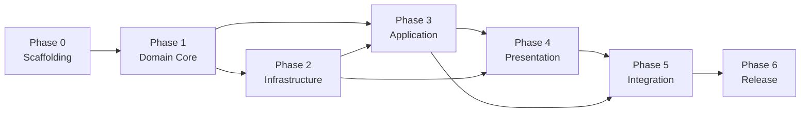

# 15_TASK.md
# Task Backlog
## rPPG Desktop Vitals Monitor

---

**Document Control**

| Field | Value |
|---|---|
| Document ID | TSK-15 |
| Version | 1.0.0 (seed) |
| Status | **LIVING** — unlike every other document in this set, this one is expected to change constantly and is never "ratified" in the same sense. |
| Depends On | Every document in this set, 00 through 14 |
| Consumed By | Nothing — this is the terminal document; work happens against it, not against a document downstream of it. |
| Precedence | Subordinate to all of `00`–`14`. A task here that contradicts any of them is a defect in this document, not a license to deviate from them. |
| Maintainer | Human Project Architect — Abdi Soleh Rosadi |
| Last Updated | 2026-07-12 |

---

## 1. Purpose and Usage of This Document

Every other document in this set (`00`–`14`) is governance: stable, deliberately slow-changing, ratified. This one is the opposite by design — it is where governance turns into work. `00 §37`'s Incremental Development Protocol, `00 §40`'s Escalation Protocol, and every "traces to `15_TASK.md`" reference scattered across the other fourteen documents all point here.

**How an agent uses this document:** pick the next `Not Started` task whose dependencies are `Done`, read the documents it traces to, do the work, satisfy `00 §19.1`'s Definition of Done, mark it `Done`, and update this file in the same change — this file going stale relative to actual repository state is itself a defect (`00 §17`).

**How this document grows:** as phases 0–2 are completed, phases 3–6 below (currently coarse-grained, deliberately) are broken down into the same level of detail phases 0–1 already have, per `00 §37`'s "the port is introduced first" sequencing — this document does not pretend to have fully planned work seven layers of architecture away from what's being built today.

---

## 2. Task Notation and Status Values

- **ID scheme:** `T-0xx` through `T-6xx`, grouped by phase (§3–§9), mirroring the `FR-1xx`/`NFR-1xx` grouping convention established in `02`.
- **Status:** `Not Started` / `In Progress` / `Blocked` / `Needs Clarification` / `Done`.
- **Traces To:** every task cites the specific document section it implements — a task with no citation is not well-formed and should not be started until it has one.
- A `Blocked` task names what it is blocked on (another task ID, or an entry in §10).

---

## 3. Phase 0 — Project Scaffolding

| ID | Task | Traces To | Status |
|---|---|---|---|
| T-001 | Initialize the seven-module Maven project structure. | `03 §8` | Not Started |
| T-002 | Configure Spotless (Palantir Java Format), Checkstyle, PMD, SpotBugs, and ArchUnit in the build. | `05 §13`, `04 §8` | Not Started |
| T-003 | Stand up the every-commit CI pipeline skeleton. | `13 §5` | Not Started |
| T-004 | Configure Maven platform profiles for native-library classifiers (Windows/macOS/Linux × x86-64/ARM64). | `00 §26`, `14 §3` | Not Started |
| T-005 | Configure JaCoCo coverage reporting and thresholds. | `13 §7` | Not Started |
| T-006 | Create `package-info.java` stubs for every package in `04 §4`'s tree. | `04 §5` | Not Started |

---

## 4. Phase 1 — Domain Core

| ID | Task | Traces To | Status |
|---|---|---|---|
| T-101 | Implement the domain value objects and the `MeasurementSession` entity. | `03 §3` | Not Started |
| T-102 | Implement the sealed `RppgApplicationException` hierarchy. | `00 §22.2`, `04 §4` | Not Started |
| T-103 | Define the four domain ports: `FrameSource`, `InferenceEngine`, `SignalEstimator`, `MeasurementRepository`. | `03 §4` | Not Started, depends on T-101 |
| T-104 | Implement `GreenChannelSignalEstimator`. | `07 §6` | Not Started, depends on T-103 |
| T-105 | Implement `ChromSignalEstimator`. | `07 §7` | Not Started, depends on T-103 |
| T-106 | Implement `PosSignalEstimator`. | `07 §8` | Not Started, depends on T-103 |
| T-107 | Implement zero-padded FFT frequency estimation and the three-component confidence score. | `08 §2`, `08 §3` | Not Started, depends on T-104–T-106 |
| T-108 | Implement `SignalQuality` state transition logic. | `08 §4` | Not Started, depends on T-107 |
| T-109 | Acquire golden-file fixtures and build the initial signal-processing test suite. | `13 §3` | Not Started, depends on T-104–T-106 |

T-104, T-105, and T-106 are independent of one another and may be worked in parallel or in any order.

---

## 5. Phase 2 — Infrastructure Adapters

| ID | Task | Traces To | Status |
|---|---|---|---|
| T-201 | Implement `OpenCvFrameSource`. | `03 §6.3` | Not Started, depends on T-103 |
| T-202 | Select and validate an ONNX face/landmark model against `09 §3`'s criteria. | `09 §3` | Not Started — see NC-001 |
| T-203 | Implement `OnnxInferenceEngine`, including ROI derivation from landmarks. | `09 §5`, `09 §6` | Not Started, depends on T-202 |
| T-204 | Implement the SQLite schema DDL and the lightweight migration runner. | `10 §3`, `10 §5` | Not Started |
| T-205 | Implement `SqliteMeasurementRepository`. | `10 §9` | Not Started, depends on T-204 |

---

## 6. Phase 3 — Application Layer

| ID | Task | Traces To | Status |
|---|---|---|---|
| T-301 | Implement the discrete use cases (`Start`/`EndMeasurementSessionUseCase`, `List`/`Get`/`DeleteSessionUseCase` family, `ListAvailableCameraDevicesUseCase`). | `03 §6.2` | Not Started, depends on T-103 |
| T-302 | Implement `LiveMeasurementOrchestrator` and the `MeasurementObserver` callback contract. | `03 §6.2`, `11` | Not Started, depends on T-104–T-108, T-201, T-203 |
| T-303 | Implement the executor topology and the capture→processing bounded queue. | `11 §2`, `11 §4` | Not Started, depends on T-302 |
| T-304 | Implement the per-executor Scoped Value correlation-ID binding. | `11 §6` | Not Started, depends on T-303 |

Further breakdown of this phase happens once Phase 2 is `Done`, per §1's growth policy.

---

## 7. Phase 4 — Presentation Layer

| ID | Task | Traces To | Status |
|---|---|---|---|
| T-401 | Build the First-Launch Disclosure screen. | `06 §6.1` | Not Started |
| T-402 | Build the Live Measurement screen, covering every state in `06 §6.2`'s table. | `06 §6.2` | Not Started, depends on T-302 |
| T-403 | Build the Session History screen. | `06 §6.3` | Not Started, depends on T-301 |
| T-404 | Build the Session Detail screen, including XChart trend rendering. | `06 §6.4` | Not Started, depends on T-301 |
| T-405 | Implement ViewModel-to-`Property` binding and the `Platform.runLater` marshaling convention across all screens. | `03 §6.4`, `11 §9` | Not Started, depends on T-401–T-404 |

Further breakdown happens once Phase 3 is `Done`.

---

## 8. Phase 5 — Integration and Hardening

| ID | Task | Traces To | Status |
|---|---|---|---|
| T-501 | Composition root wiring (`rppg-app`): dependency assembly, executor and connection shutdown sequencing. | `03 §8`, `11 §8` | Not Started, depends on T-401–T-405 |
| T-502 | Build the fault-injection and security/privacy assertion test suites. | `13 §2` | Not Started, depends on T-501 |
| T-503 | Build the JMH microbenchmark suite and record the first baseline. | `12 §8` | Not Started, depends on T-501 |
| T-504 | Instrument and validate end-to-end latency against `12 §4`'s budget. | `12 §4` | Not Started, depends on T-501 |
| T-505 | Measure and, if necessary, optimize cold-start time — flagged high-risk by `12 §6`, schedule this early within the phase, not last. | `12 §6` | Not Started, depends on T-501 |
| T-506 | Author the manual UI checklist document. | `13 §4` | Not Started, depends on T-402–T-404 |

---

## 9. Phase 6 — Release

| ID | Task | Traces To | Status |
|---|---|---|---|
| T-601 | Configure `jlink`/`jpackage` builds for all three target platforms. | `14 §2`, `14 §3` | Not Started, depends on T-004 |
| T-602 | Run the first packaging dry run and smoke test on all three platforms. | `14 §4`, `14 §8` | Not Started, depends on T-502–T-506, T-601 |
| T-603 | Cut the v1.0.0 release. | `14 §8` | Not Started, depends on T-602 |

---

## 10. Needs Clarification

Per `00 §40`, open questions this document set deliberately deferred rather than guessed at:

| ID | Question | Deferred By | Blocks |
|---|---|---|---|
| NC-001 | Which specific ONNX face/landmark model artifact (source, license, exact provenance) is adopted? | `09 §3` | T-202 |
| NC-002 | What are the exact weights for the three confidence-score components (spectral SNR, temporal consistency, ROI stability)? | `08 §3` | Tuning of T-107, not its initial implementation |
| NC-003 | Are the indicative hex colors in `06 §7` acceptable as final, or do they need visual-design refinement? | `06 §7` | T-402–T-404's final polish, not their initial construction |

---

## 11. Phase Dependency Overview

---

## 12. Closing Note

This is the sixteenth and final document of the set. `00_MASTER_PROMPT.md` opened by stating that an autonomous agent's first responsibility is to read that document before touching any code. This document is where that instruction cashes out into an actual first action: start at T-001.

---

## 13. Revision History

| Version | Date | Change |
|---|---|---|
| 1.0.0 | 2026-07-12 | Initial seed backlog, derived from `00`–`14`, all v1.0.0. Phases 0–2 fully broken down; phases 3–6 intentionally coarse, per §1. |

---

*End of 15_TASK.md — and of the 00–15 document set. This document is living; all others are binding governance it operates under.*